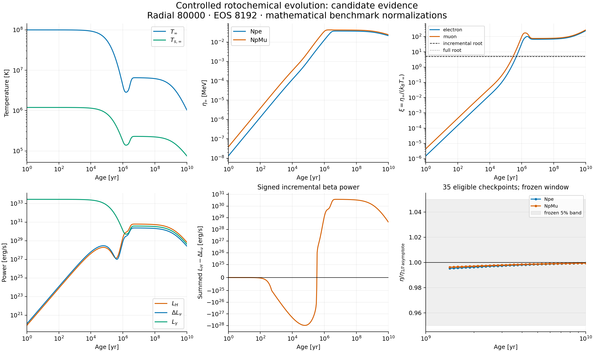

# Phase-5D-1 response implementation and pre-result blocker

> **Current Phase-5D-1C2 disposition: A — controlled non-superfluid evolution IMPLEMENTED / CANDIDATE-VALIDATED.** The first provenance-preserving coupled trajectory, refined convergence and complete validation pass. Global INV-11 awaits independent review and owner ratification; no canonical integration is claimed. See the clearly separated Phase-5D-1C2 section below and [130-field final report](PHASE5D1_PROVENANCE_PRESERVING_FINAL_REPORT.md). The original blocker sections that follow are retained historical records.

**Disposition B: PHASE-5D RESPONSE MACHINERY VALIDATED — COUPLED SECULAR EVOLUTION BLOCKED ON NUMERICAL ARCHITECTURE.** Here the numerical blocker is the frozen upstream coefficient-acceptance budget, before ODE construction. This is not a finding that RKF45 is unsuitable, or that accepted ADR-0014 is inconsistent. There is no complete controlled-evolution candidate.

## Identity and authority

Canonical entry `d019ae390be4f5e3daba05039903485cb497e397`; branch `physics/phase5d-controlled-rotochemical-evolution`; worktree `/Users/keeper/Documents/CompactStar/worktrees/CompactStar-phase5d-controlled-evolution`. Entry was clean, branch/worktree absent, canonical master and live origin master matched the entry. Canonical master was not modified. Source/architecture/validation specialists ran concurrently, read-only, using Astra HIGH. Lead/root Agent D was the sole writer. Required governance, ADR-0010/0011/0013/0014, integration/preflight/ratification records and current status documents were read. All 22 authenticated shared literature manifest entries passed; no literature was downloaded.

`PHASE5D1_PREDECLARATION_SHA = 697ec14610d63640866f3c0aed0a51d567cb037d`.
`PHASE5D1_RESPONSE_SHA = 14b74cba1a0c7b6faec591aedf6f5c9a76fa42d6`.
`PHASE5D1_EVOLUTION_SHA = NOT CREATED`.
`PHASE5D1_CANDIDATE_SHA = NOT CREATED`.

The first two exact required commit messages were used. The successful-coupling/candidate commit messages would overstate this outcome and are not used. The scratch implementation map preceded production writes and remains at `build/phase5d-audit/implementation-map.md`.

## Exact blocker and responsibility

The lead selected radial resolution 10000 in the predeclaration before qualifying its W precision. This was a preparation error in this implementation attempt, not a regression of governed Phase-5C. The fresh Structure-1 assembly at rho_c=1.10e15 g/cm^3 computationally accepted G and Z, then unchanged production `RotochemicalSpinDrive::Compute` refused W with `AccuracyGoalUnmet` at `ChemicalResponse.cpp:804`. The unchanged upstream `chemical_production_fixture` reproduces raw rc=1 without the Phase-5D coupling wrapper. The separate structural-validation-envelope gate at line 805 was not the failing gate.

| Channel | Positive structural terms in attempted W numerical budget [MeV s^2] | Frozen numerical goal [MeV s^2] | Ratio |
|---|---:|---:|---:|
| Npe | 8.918515424724095e-12 | 1e-12 | 8.918515424724095 |
| NpMu | 3.263850588763438e-11 | 4e-12 | 8.159626471908595 |

These are `sum_j abs(Z_ij)*E_Ij`, already exceeding each goal before adding nonnegative Z-error/cross-error/arithmetic terms. They diagnose the attempted discrete calculation, not certified physical continuum uncertainty. No W result escaped its factory and no coupled trajectory was generated. The raw `STOP` and rc=1 are retained, irrespective of the unrelated logger footer saying zero logged errors.

An additional preparation defect: the scratch certificate reused background/provider/anchor errors characterized at radial 40000/80000, recomputing only the new tail for radial10000. Computational G/Z acceptance therefore does not scientifically qualify radial10000. Honest fresh background characterization is still required; reducing/relabeling error or weakening W goals cannot repair this defect. Read-only specialist comparison found unchanged coefficient arithmetic and correct certificate transport/order. A different baseline resolution would amend the frozen predeclaration; its 20000 variant is explicitly a Ltilde comparison, not an authorized replacement baseline. The predeclaration's pre-result-impossibility stop rule is obeyed. No ADR revision is proposed and no impossibility at every resolution is claimed.

Machine evidence: [phase5d1_w_assembly_refusal.json](phase5d1_w_assembly_refusal.json) and [raw refusal excerpt](phase5d1_refusal_excerpt.txt). Full raw logs, certificate inputs, generated profile/table, toolchain/build logs and diagnostic code remain under `build/phase5d-audit/`. The debugger attempt was terminated without a usable result; the recorded numerical bound comes from explicit test-side diagnostics, not the debugger. No acceptance goal was relaxed for diagnosis.

## Retained production components

All retained physics is under `CompactStar/Physics/Rotochemical/`:

- `ChemicalImbalanceState.hpp`: typed Npe/NpMu ordering, eta_inf in MeV, explicit ChemState read/store, local-redshift and xi helpers. It is not yet an integrated evolved chemical block.
- `UrcaImbalanceFunctions.hpp`: independent pure FD/HD/FM/HM and stable F-minus-one polynomials. HM ends in pi^8, consistent with the ratified primary-source reconciliation; no published-erratum claim.
- `UrcaChannelNormalization.hpp`: typed process selection, local positive normalization, explicit ordered disjoint support intervals, independently constructible DU triangle check.
- `GlobalUrcaChannelCoefficient.hpp` and `src/GlobalUrcaChannelCoefficient.cpp`: immutable independent stellar integral, shared governed chemical-domain owner and currentness. Integral is `1e15 integral_Da 4*pi*r_km^2 exp(lambda+(2-q)*nu) S dr_km`; units erg s^-1 K^-q. It does not reuse G_y's inverse lapse or 1e54 count-volume normalization.
- `RotochemicalReactionResponse.hpp`: xi=eta_inf/(kB_MeV*Tinf_K); rate=Ltilde*Tinf^(q-1)*H/kB_erg in count/s; equilibrium/full/incremental luminosities and internal eta dot R in MeV/s. `RotochemicalThermalPower::From` converts that power once to erg/s and distinguishes LH-DeltaLnu from LH-Lnu_full.

New CMake file registers the global integrator. Existing files modified for retained code: only `CompactStar/Physics/CMakeLists.txt` and `tests/CMakeLists.txt`. Tests are `tests/rotochemical/response.cpp` and `oracles.py`. All thermal, photon, heat-capacity, EvolutionSystem, GSLIntegrator, StarContext, Z/W and EOS production files remain unchanged from entry.

Single kB authority: Zaki::Physics::K_BOLTZ_EV, scaled to MeV/K; kB_erg is derived using the governed MeV-to-erg conversion. Thermal input is K. Intended future state remains `(ln(Tinf/1e8 K),eta_npe_inf,eta_npmu_inf)`, eta in MeV. No deltaN public evolved state, torque law, A18, superfluidity, DU benchmark activation or BNV was added.

## Frozen experiment and unfinished coupling

Predeclared local SMe=1e-51 and SMmu=2e-51 erg cm^-3 s^-1 K^-8, positive constants on their species supports, are mathematical/architecture inputs only. Me/Mmu enabled; De/Dmu explicitly disabled. T0=1e8 K, eta0=(0,0) MeV. External prescribed timing: B=1e8 G, P0=1ms, PPdot=(B/3.2e19)^2, P=sqrt(P0^2+2 PPdot t), Omega=2pi/P, OmegaDot=-2pi PPdot/P^3. Interval 0..1e10 yr, year=365.25*86400s. Intended RKF45 rtol=1e-7, absolute tolerances=(1e-12,1e-18,1e-18), refined by 100. These are declarations, not completed-run settings/results.

No final T/eta/xi, heating activation, thermal sign history, transient, stiffness diagnostic, ODE convergence, radial Ltilde convergence or quasi-steady/1/7 fit exists. No physical fixture Ltilde was produced because assembly stops before that operation. The exact same-Ltilde identity is tested at response/ledger level; actual equilibrium-driver replacement, no-double-counting in a coupled RHS, spin-only ODE, cross-Z reaction-only/Lyapunov/linear oracles and state-ordering independence remain pending.

Uncommitted coupling work was archived intact at `build/phase5d-audit/uncommitted-coupling/` (tracked patch, new files, SHA256 manifest) and removed from the active source tree before final testing. It includes draft spin seams, frozen Z/W bundle, thermal adapter, component tolerances and benchmark runner. It must not be treated as implemented/validated. The read-only architecture audit identified six unfinished guards: callback currentness, shared spin owner, semantic Z channel validation, empty-channel thermal denominator, dependency checks before RHS accumulation, and controlled radial/provenance diagnostics. The immutable thermal-table/source-byte boundary was also unfinished. No evolution commit was made.

## Analytic evidence and limitations

Two focused CTests cover state/units/redshift, source functions, parity, small/large limits, four ratified roots, reaction sign and eta R positivity, zero-imbalance rates/increments/heating, response-level same-owner ledger, support/process/domain/currentness controls. Independent high-precision R1995 Fermi convolutions check both DU and MU F/H, relative tolerance 3e-14. RE10b independently compares a power-series antiderivative and mpmath quadrature before checking actual production GL integration at the predeclared relative tolerance 1e-10.

RE10b uses nonconstant nu=-0.4+0.1x^2 and lambda=0.2x^2, S=1e-40(2+x^2), disjoint support [0.2,0.45] union [0.7,0.9], q=6 and8. S is nonzero outside support. Seventeen distinct transformed-input cases (nine integral mutation families across q=6 and q=8; the q=6 wrong-q/extra-two-lapse alias is counted once) are rejected by the oracle: missing lapse, altered one-/two-lapse powers, wrong-sign lapse, omitted/inverted proper volume, wrong q and wrong domain. These are actual-integrator transformed-input controls, not source-code mutation builds. A final test-only accounting correction removes that redundant q=6 case; the physics, oracle, benchmark inputs and tolerances are unchanged. Other requested coupling mutation families remain pending; no inflated mutation total or complete RE-ladder pass is claimed. Test banners are not independent evidence. The final banner explicitly limits the claim to focused response checks; RE12/RE16-18 references on individual assertions cover only their response/support subsets.

## Retained-caveat closure table

| Caveat | Disposition at this stop |
|---|---|
| 1 enabled-process owner | Implemented typed UrcaProcessSelection. |
| 2 constructible DU sliver/configuration control | Passed synthetic positive triangle below guard; disabled DU source must never execute. |
| 3 predeclared RE10b tolerance | 1e-10 committed before coupled output. |
| 4 nontrivial nu/lambda | Passed curved manufactured fixture. |
| 5 S nonzero outside D_a | Passed; wrong-domain control nonvacuous. |
| 6 G_y/domain semantic relationship | Shared current owner and identity, separate lapse/volume normalization; physical fixture qualification pending. |
| 7 upstream INV-11 authority | Preserved; global INV-11 unresolved. |
| 8 banners not independent evidence | Explicitly retained; actual assertions/oracles/results determine coverage. |
| 9 M10/M11 historical qualification | Historical record unchanged; one algebraic integrated-lapse family, not two credits. |
| 10 innermost-first assertion | Unordered partition explicitly rejected. |
| 11 disconnected/outer support | Disjoint integrals and closed-inner throwing-source test pass. |
| 12 benchmark not realistic Ltilde | Explicit mathematical classification; realistic closure remains blocked. |

These closures concern retained response components; they do not close the full Phase-5D candidate.

## Validation and protected state

Final results: focused analytic 2/2, data-free 47/47 (disjoint 25+22 serial selections), complete authenticated suite 70/70; every completed suite raw rc=0, no CTest failures/skips. The final focused oracle confirms 17 distinct mutation cases. Inspectable commands, counts, log/source hashes and protected-file hashes are in [phase5d1_response_validation.json](phase5d1_response_validation.json), the companion final report and `build/phase5d-audit/suite-return-codes.json`. The entry build and separately executed Phase-5B/5C governed regressions passed raw rc=0 (2/2). The W assembly diagnostics failed raw rc=1 as reported above; these are not hidden as skipped/passing CTests. No coupled CTest is registered or claimed complete.

All ten existing governed baselines, the Phase-5C candidate and all authenticated data/literature files were byte-compared against entry: 54 files checked, zero mismatches. Phase5B SHA256 remains `7588f0e9cd62f5b6be48bb725e4d0ba6e47b64f50d843117e70c17a78beeb5fa`; Phase5C remains `7027aa6179fe9111d76586d467d007c4223ec9d26ece0fee773327973c77bfe7`; Phase5C candidate remains `a6b430b2356987b54a7c82c87d0b00f3e1d9698f6f299c32c80efcc40c63833b`. No new baseline, no regenerated baseline, no EOS/data/literature modification, no merge.

INV-11b/c/d have partial response implementation with focused analytic validation; integrated evolved-state/reaction/thermal clauses remain pending. INV-11e run-level frozen Z/W semantics remain pending. INV-11f remains unresolved and blocked before coupling. Global INV-11 remains UNRESOLVED / AWAITING IMPLEMENTATION, INDEPENDENT REVIEW AND OWNER RATIFICATION. Realistic A18/FR2005 normalization remains SOURCE-LIMITED / BLOCKED; BNV NOT BEGUN.

## One recommended next action

Review this pre-result blocker and authorize a revised predeclaration only after freshly qualifying the background and structural resolution against the unchanged governed Phase-5C acceptance goals, before resuming coupled evolution. This next action has not begun.

## Phase-5D-1C2 provenance-preserving implementation (2026-09-11)

This section records the downstream reimplementation from the frozen-context plan
`f7116c1408c06f976527f86d4397ad6d4540dedf`. The earlier radial-10000 W-budget
blocker above and the subsequent archived upstream-provenance regression remain
historical evidence. The second draft changed the equality-bearing source identities of
`Analysis/src/ParticleNumberResponse.cpp` and `Analysis/src/ChemicalResponse.cpp`;
both governed regressions correctly failed with raw CTest rc=8. Its unchanged
scientific payload was not a waiver of source provenance. That draft remained
uncommitted and generated no authorized trajectory. Neither draft supplies current
validation credit. The provenance-preserving controlled implementation is now **IMPLEMENTED /
CANDIDATE-VALIDATED**; complete validation and protected-state evidence are recorded below.

The authenticated entry was clean: local/upstream/live branch all equalled the
plan SHA; canonical local/origin/live master all equalled
`d019ae390be4f5e3daba05039903485cb497e397`. Root/integrator was the sole repository
writer. Provenance, thermal-ledger, and numerical specialists reviewed read-only
using Astra HIGH. Their implementation reviews do not constitute the independent
scientific review required for ratification.

### Frozen authority and write boundary

All 33 exact `UNION_GOVERNED_SOURCE_HASH_SET` entry hashes were recorded before
implementation in `build/phase5d1c2-audit/entry-hashes.json`. Ten governed baselines,
the named Phase-5C candidate, authenticated EOS/data and literature bytes remained
unchanged at entry. The executable harness checks the exact path set as well as
hashes; missing, duplicate, or altered manifest entries fail. The immediate
pretrajectory gate also requires both named governed regressions to run and return
zero (`--no-tests=error`). There is no source-hash portability exception.

The new production files are exclusively under `CompactStar/Physics/Rotochemical/`:
`FrozenSource.hpp`, `FrozenThermalSource.hpp`, `PrescribedSpinHistory.hpp`,
`FrozenRotochemicalRunContext.hpp`, `SecularEvolutionDriver.hpp`, and
`ScaledRKF45.hpp`. Generic evolution, GSLIntegrator, thermal-driver, Analysis, EOS,
and Core sources are unchanged. New tests are downstream in `tests/rotochemical/`
and registered in `tests/CMakeLists.txt`.

`FrozenRotochemicalRunContext` receives semantic Z and fixed-baryon authorities,
qualified Ltilde channels, immutable thermal sources, one shared spin owner,
qualification identities, and a revision token. It constructs W exactly once with
`RotochemicalSpinDrive::Compute` from the retained Z/fixed-baryon authorities. It
retains G, Z, W, fixed-baryon response, provider, revision, strong NStar owners,
source provenance, Ltilde, and private thermal authorities. Typed private Z/W/I
snapshots remain attached to these owners. Public coefficient access is semantic
and currentness-guarded. No runtime baseline/candidate JSON supplies coefficients;
no Z/W arithmetic or source buffering was added to Analysis.

Construction requires radial 80000, EOS 8192, rho_c=1.10e15 g/cm^3, Npe/NpMu order,
2x2 Z with both cross terms, two W channels, matching semantic domain/partition and
qualified profile/model/EOS/certificate bytes. Production accepts the fixed
prescribed dipole implementation and Me/Mmu selection with De/Dmu disabled.
Analytic-control contexts explicitly support zero/one active channel and test spin
histories; they cannot authorize the physical trajectory path.

Full upstream `RequireCurrent` and source-byte checks run at construction and
before each integration. Every RHS checks cheap retained owner identities,
revision/provider metadata, profile versions, structural EOS/Hartle provenance,
thermal geometry, and spin/source tokens before evaluation and before publishing
its result. All derivatives and thermal contributions are assembled in temporaries.
External derivative and accumulator sentinels remain unchanged on early and late
injected failure. Caller-handle destruction leaves a runnable context; actual
upstream profile `Touch()` then invalidates it before derivative writes.

### Eight architecture guards

| Guard | Executed closure |
|---|---|
| Callback currentness | Production rejects arbitrary callback implementations; token and identity validation precedes evaluation. |
| Shared spin | One strong `shared_ptr<const PrescribedSpinHistory>` supplies Omega/OmegaDot in one sample; stale and foreign owners refuse. |
| Semantic Z | Exact order/shape and both cross terms; W is built from the exact retained Z and covered fixed-baryon owner. Swapped order, wrong shape, foreign fixed owner and individual cross-row omissions are detected. |
| Empty channels | All controlled rates/cooling/increment/heating are exactly zero while Cstar and photon cooling remain finite. |
| Dependency before RHS | Stale source/support/profile, foreign thermal/geometry, malformed accumulator, and late invalidation preserve sentinels. |
| Radial/provenance | Exact qualified bytes and resolution; altered profile/certificate copies and changed partition endpoint refuse. |
| Thermal bytes | Retained paths/bytes/SHA256 and const parsed table; deterministic parse race/pre-run change refuse; sealed runtime does not reread. |
| Governed immutability | Exact33 manifest positive/negative controls pass; immediate pretrajectory and final governed gates are separately required. |

### Thermal and spin ledger

`FrozenThermalSource` owns all four CompOSE input files, their SHA256 identities,
and an internally allocated const parsed/interpolated table. The predeclared
fixed-background free-gas entropy adapter uses T planes {0,1,2,4} MeV and identical
Yq planes {0,1}, positive density nodes, no clamp, and zero derivative floor.
The existing `StarContext::HeatCapacityStar_Tinf` convention and its 160-node
log-temperature cache remain unchanged. The context owns matching StarContext and
GeometryCache and the existing iron Potekhin1997 photon authority. Its explicit
non-controlled neutrino authority has DU/MU/PBF disabled for this benchmark, giving
Lnu_other=0. Legacy behavior elsewhere is unchanged.

One context-owned Ltilde authority supplies each controlled channel's
`Lnu_eq=Ltilde*Tinf^8`, `DeltaLnu=Ltilde*(F_M(xi)-1)*Tinf^8`,
`Lnu_full=Lnu_eq+DeltaLnu`, and `R=(Ltilde/kB_erg)*Tinf^7*H_M(xi)`.
`LH_MeV_s=eta_npe*R_e+eta_npmu*R_mu` crosses the governed MeV-to-erg boundary once,
through `RotochemicalThermalPower::From`. Thus
`DeltaP_beta=LH-DeltaLnu` and
`Pnet=DeltaP_beta-Lnu_eq_controlled-Lgamma-Lnu_other`.
Historical placeholder MU cooling is absent from this controlled ledger.
The zero-imbalance coupled RE9 test reduces exactly to the same controlled
equilibrium cooling, including the actual accumulated thermal derivative.

The evolved state is `(ln(Tinf/1e8 K), eta_npe_inf [MeV], eta_npmu_inf [MeV])`.
`dot eta=-Z R+2 W Omega OmegaDot`; both cross terms are retained, with no dot(Z).
`dot ln(Tinf/1e8)=Pnet/(Cstar*Tinf)`.
The single spin owner supplies the unchanged B=1e8 G, P0=1ms law,
`PPdot=(B/3.2e19)^2`, `P=sqrt(P0^2+2*PPdot*t)`, `Omega=2*pi/P`, and
`OmegaDot=-2*pi*PPdot/P^3`. An independent finite-difference derivative test passes.

Physical Ltilde values from the qualified radial80000 fixture are
`1.812909813491381e-32` (Me) and `9.8504968582611409e-34` (Mmu), in
`erg s^-1 K^-8`. SMe=1e-51 and SMmu=2e-51 erg cm^-3 s^-1 K^-8 remain mathematical /
architecture benchmark normalizations. GL16 versus GL32 plus segment bisection
relative differences are `4.8309713681580895e-14` and `6.9461243999055514e-15`,
below the frozen 1e-6 goal. This is representation-level numerical stability,
not a continuum uncertainty bound or realistic FR2005 normalization.

### Numerical adapter and focused evidence

The local `ScaledRKF45` uses `gsl_odeiv2_step_rkf45` and
`gsl_odeiv2_control_scaled_new(1, rtol, 1, 0, component_atol, 3)`.
The actual GSL error level is `atol_i+rtol*abs(y_i)`: eps_abs=1,
eps_rel=rtol, a_y=1, a_dydt=0. Baseline rtol=1e-7 and atols=(1e-12,1e-18,1e-18);
refined rtol=1e-9 and atols=(1e-14,1e-20,1e-20). Executable tests query GSL's actual
component error levels. The executable disables GSL's aborting error handler;
exceptions are transported across the callback boundary and fail the run.
There is no generic solver redesign or clipping. Accepted steps validate state,
thermal cache bounds and complete endpoint rates/powers. The frozen limit is
100000 internal steps per checkpoint.

The pretrajectory coupled oracle execution returned raw rc=0. Spin-only maximum relative
error is `4.1907178240110105e-16`; reaction-only two-temperature/signed-eta linear
oracle maximum relative error is `1.0690936789558023e-09`, each below 1e-6.
Active- and dead-channel Lyapunov tests, cross-Z relaxation, independent SI thermal
ledger, coupled RE9, all eight guard controls, and disconnected-support/disabled-DU
controls passed. The retained response suite passed 2/2 with raw rc=0.

The pretrajectory execution detected twenty named transformed-production mutation cases through the
actual EvolutionSystem. They are not source-edit mutation builds. Fourteen
conservative families are credited: W-sign/OmegaDot-sign, eta-sign/reaction-sign,
and full-increment/double-equilibrium are respective aliases; three cross-Z
omission variants receive one family credit, and the two double-kB interpretations
receive one family credit. Coverage includes factor two, channel swap, wrong/absent/
doubled kB, T^8 rate power, absent/double MeV conversion, omitted heating, and actual
legacy placeholder injection. Raw case/refusal lists and executed-image hashes
are in `build/phase5d1c2-audit/oracles-final/oracle-results.json` and its console log.

### Archived draft audit

The archived manifest SHA256 is
`4815dc19157875de0b58de851824e4fadf72a17b59555f2de8056e971f91263c`; tracked patch
SHA256 is `76eae7e209cb7567f45171520d456b40dc809ea35d8adb8c0bf15ee0f8316368`.
All 112 manifest file hashes were checked. No whole patch or complete archived
file was restored. The 28 original draft components are individually classified
in `build/phase5d1c2-audit/archive-decisions.json`: upstream Analysis edits and old
draft status/evidence were rejected; useful spin, ledger, solver, fixture, oracle,
and validator concepts were reimplemented in the downstream boundary. Channels
quadrature, fixture transport, independent 2x2 exponential, and validator design
were reaudited adaptations, with no historical test credit.

### Qualified fixture values before the first trajectory

The radial20000 diagnostic gives Ltilde_Me=`1.8133381727518461e-32` and
Ltilde_Mmu=`9.8504963782198603e-34` erg s^-1 K^-8. Relative differences from
production radial80000 are `0.00023628271923805636` and
`4.8732697187797193e-08`, respectively; both satisfy the unchanged 5e-3 goal.
The production radial resolution remains 80000.

The retained public semantic factories produce, in Npe/NpMu order,

```
Z [MeV/count] = [[4.5793031807026964e-54, 5.1725199102788047e-55],
                 [5.1725199102788054e-55, 1.0268727975139168e-52]]
W [MeV s^2]   = [-5.4061775017047245e-07, -1.5845719480103649e-06]
I [count s^2] = [-1.1637998545112904e+47, -1.484481985023382e+46]
```

These are recorded output values, never literal RHS inputs. Me support is
[0,12.643787595748499] km; Mmu support is [0,3.2790922387863324] km. Normalization
identities explicitly name the unchanged mathematical SMe/SMmu values.

| Owned thermal source | SHA256 |
|---|---|
| eos.t | `a34c76462115f14fb3d93516e1229e77240c46a9cc55bc3970f9e32251759468` |
| eos.nb | `7fd7ab7fc583878cc211d5479ea9dcee87b3b6b8eb255c771ea4babb7e195735` |
| eos.yq | `45125714a8b219f0e5677e69c295620d0de0f66ddee4e0e7cd3e67d964b69258` |
| eos.thermo | `4914e553eadb026c4d63036525d24ec08296b2cc1d418ddb385a2ed8d1ab7935` |

The full absolute input paths, qualified model/profile/EOS/certificate hashes,
executed-image hash, CMake-cache hash, spin identity and thermal authorities were
recorded in the run provenance and console before `PRE_TRAJECTORY_READY`.

### First coupled trajectory and numerical validation

`PHASE5D1_EVOLUTION_SHA = d3670f6d4e021def0483909b6d2fdeed1c6973a4`

The exact commit message is `feat: couple rotochemical secular evolution`. It contains only the 17 intended downstream production/test/CMake files. The executed image was built before this commit; all 103 recorded source hashes were subsequently matched against its committed tree. No prior history was squashed.

Immediately before the first physical trajectory, the exact 33-path protected hash check passed and the Phase-5B / Phase-5C governed regressions each ran 1/1 with raw rc=0. Hashes were checked again before the harness released its waiting process. Both thermal-source and full semantic currentness checks then ran before integration.

Baseline, refined, and all four predeclared initial-condition trajectories completed 0..1e10 yr, raw executable rc=0. Each contains the initial state and 401 fixed logarithmic checkpoints. All accepted states remained finite, Tinf positive and inside the declared thermal cache domain; rates, powers and spin were finite, with no clipping or dependency changes. The trajectory validator returned raw rc=0. Checkpoints and exact end-state values are in [the candidate artifact](phase5d1_controlled_evolution_candidate.json).

| Final quantity | Value |
|---|---:|
| Tinf_K | 1030441.4596289885 K |
| Tsurface_inf_K | 75082.805533038438 K |
| eta_e_MeV | 0.021510445901899329 MeV |
| eta_mu_MeV | 0.024299132258749929 MeV |
| xi_e | 242.24409542012097  |
| xi_mu | 273.64943248317354  |
| Omega | 2347.5475293446275 rad/s |
| Omega_dot | -3.2002469209335231e-15 rad/s^2 |
| R_e | 1.752286823396162e+36 count/s |
| R_mu | 2.2321577268888389e+35 count/s |
| Lnu_eq | 24296377871460988 erg/s |
| DeltaLnu | 2.5954427679404978e+28 erg/s |
| LH | 6.9080121470151791e+28 erg/s |
| DeltaPbeta | 4.3125693790746813e+28 erg/s |
| Lgamma | 4.3129253126559969e+28 erg/s |
| Lother_neutrino | 0 erg/s |
| Pnet | -3.5593358374507878e+24 erg/s |

| RKF45 statistic | Baseline | Refined |
|---|---:|---:|
| accepted | 8828 | 10415 |
| rejected | 1618 | 2183 |
| RHS | 71505 | 86004 |
| min_step_s | 1 | 1 |
| max_step_s | 65697735351472 | 59697642615776 |
| rejection_fraction | 0.15489182462186482 | 0.17328147324972218 |
| maximum_accepted_steps_per_checkpoint | 362 | 364 |

RHS counts include accepted-endpoint derivative validation. The maximum per-checkpoint accepted counts, 362/364, are far below 100000; the saved late-time step history shows no step collapse. Local Jacobians at the preselected 1e6, 1e8 and 1e10 yr have eigenvalue-magnitude ratios about 481.82, 2.0943 and 28.672. Positive modal relaxation magnitudes are distinct from the recorded signed inverse real eigenvalues. Instantaneous reaction, thermal and spin timescales are included separately. RKF45 is adequate for this controlled benchmark; no conclusion extends to future DU or superfluid cases.

| Common-checkpoint maximum relative difference | Value | Frozen acceptance |
|---|---:|---|
| Tinf_K | 1.7408584682611815e-05 | <=2e-4; PASS |
| eta_e_MeV | 1.5866651419012378e-07 | <=2e-4; PASS |
| eta_mu_MeV | 1.9479546821964215e-07 | <=2e-4; PASS |
| xi_e | 1.7387445455634339e-05 | reported diagnostic |
| xi_mu | 1.7448183109581896e-05 | reported diagnostic |
| LH | 1.9340242731514387e-05 | reported diagnostic |
| DeltaLnu | 2.5373918741539931e-05 | reported diagnostic |
| DeltaPbeta | 0.00013316625368904651 | reported diagnostic |

Eta uses the predeclared denominator max(abs(ref),1e-10 MeV). Every initial-condition variant approaches the baseline endpoint within 1%; the largest measured endpoint relative discrepancy is 1.1269708566352676e-07. The T1e7/T1e9 and xi1/xi20 variants are validation runs, not changed production inputs.

Both baseline and refined checkpoint ledgers reconstruct Pnet, DeltaP_beta, full controlled neutrino power and x_dot with zero measured normalized roundoff residual in the saved representation. The cancellation-sensitive Pnet comparison reaches 1.02093% relative difference near 5.95662e6 yr; there its absolute difference is 1.34251e23 erg/s, only 1.1008e-8 of gross ledger power. This is explicitly reported rather than treated as an additional convergence pass; the frozen T/eta criteria pass unchanged.

### Thermal crossings and frozen quasi-steady criterion

Channel roots are distinct: incremental LH-DeltaLnu uses xi=4.909710028924132; full heating minus full neutrino power uses xi=5.633717467648343.

| Diagnostic | Channel | Time bracket [yr] | Log-interpolated estimate [yr] |
|---|---|---|---:|
| incremental | xi_e | 446683.5922 .. 473151.259 | 459453.1567 |
| incremental | xi_mu | 281838.2931 .. 298538.2619 | 287057.1372 |
| full | xi_e | 473151.259 .. 501187.2336 | 486585.5972 |
| full | xi_mu | 298538.2619 .. 316227.766 | 305933.1006 |

These estimates are derived from fixed checkpoints, not event-localized times. The **summed** DeltaP_beta crosses within 334965.4392..354813.3892 yr (interpolated estimate 336280.5008 yr), distinct from either individual channel root. Negative and positive incremental beta power both occur. The summed full heating-minus-neutrino power crosses later, within 354813.3892..375837.4043 yr (interpolated estimate 373948.5459 yr).

The predeclared window remains 1e9..1e10 yr. Thirty-five checkpoints meet both abs(xi)>=100, beginning at 1.4125375446e9 yr by the fixed eligibility rule. No fit range was chosen after viewing results.

| Channel | Maximum relative asymptote error (goal <=0.05) | Log slope (goal 1/7 +/-0.015) | Result |
|---|---:|---:|---|
| eta_e_MeV | 0.0047678802070558746 | 0.14130437252418679 | PASS |
| eta_mu_MeV | 0.0037842933840810389 | 0.14166915596806406 | PASS |

The maximum eligible relative thermal residual is 0.00011485882331340723; photon power versus the large-xi 5/8 heating diagnostic differs by at most 0.0064789887337916019. The controlled 1/7 test is PASS. Realistic FR2005/A18 normalization remains SOURCE-LIMITED / BLOCKED, and BNV remains NOT BEGUN.



The plot uses the saved baseline checkpoints; t=0 is omitted only from logarithmic
age axes and remains in the machine evidence. Signed incremental power uses a
symmetric-log scale with a linear band |P|<1e25 erg/s. The last panel shows only
checkpoints satisfying the unchanged eligibility rule inside the frozen window.

### Reproduction boundary

The coupled harness requires the authenticated radial80000/EOS8192 qualification
profile, free-gas table, model and certificate, plus the exact entry manifest.
`COMPACTSTAR_PHASE5D_QUALIFICATION_ROOT` selects the qualification directory;
its source-byte hashes remain fixed. See the structural qualification and frozen
provenance plan for input production and authority. Missing inputs fail closed;
they are not skipped tests and do not trigger automatic requalification or baseline
installation. Use a fresh build/evidence directory, build the executable, run
`qualified_suite.py ... oracles --output build/phase5d1c2-audit/oracles-final`, then
`qualified_suite.py ... trajectory --output <fresh-output-directory>` and
`validate_trajectory.py <fresh-output-directory>`. The trajectory harness requires
the exact passing oracle image and runs the immediate governed gate itself.

### Final authority coverage and complete validation

The final authority-to-test audit added three test-only controls in
`tests/rotochemical/coupled_oracles.hpp`: an actual eta state-slot swap before
channel normalization (M5), transpose of the full `Z*diag(rate slopes)` map (M6,
both signs and both temperatures), and the predeclared signed DU/MU `F'=3H`
identity using an independent five-point finite difference. The expanded
qualified coupled execution passed with raw rc=0. It detected **22 named
transformed cases / 16 conservative families**. Production, solver, fixture and
trajectory sources remained byte-identical to the evolution commit; the original
physical trajectory image and its 103 source hashes are preserved. The candidate
artifact records the one test-file hash delta and the separate expanded image.

The M1–M37 preflight inventory has explicit transformed controls, independent
analytic detectors and support/currentness/ownership refusals, as mapped in
`preflight_mutation_inventory_coverage` in the candidate. These are not 37
independently executed mutation builds. The retained response tests execute
17 transformed-input integral cases across nine families. Aliases receive no
extra credit. Neither polynomial coefficients nor acceptance goals changed.

The complete authenticated CTest invocation ran **73/73 tests**, raw rc=0,
zero failures and zero skips. Its actually executed projections include all
**50/50 data-free tests**, retained response **2/2**, and registered coupled
**3/3** tests. The final test-only expansion was additionally rebuilt and rerun
with raw rc=0; it is reported separately rather than attributed retroactively
to the original complete-suite image. The six physical trajectories and the
checkpoint validator each completed with raw rc=0.

After implementation and evidence edits, the final governed gate again ran
Phase-5B **1/1 PASS, raw rc=0** and Phase-5C **1/1 PASS, raw rc=0**. All **33/33**
protected sources equal entry; all ten governed baselines, the Phase-5C candidate,
and all 54 authenticated artifact/data/literature entries remain unchanged.
Generic Evolution/Driver, Analysis, EOS and Core have no task diff. No portability
exception, baseline replacement, radial retuning or tolerance relaxation occurred.

INV-11b/c/d are IMPLEMENTED / CANDIDATE-VALIDATED; INV-11e has that status for
frozen-v1 semantics and INV-11f for controlled v1. Global INV-11 remains
UNRESOLVED / AWAITING INDEPENDENT REVIEW AND OWNER RATIFICATION. Realistic
FR2005/A18 remains SOURCE-LIMITED / BLOCKED; BNV is NOT BEGUN. No canonical merge,
independent scientific review or owner ratification is claimed.

The complete [130-field final report](PHASE5D1_PROVENANCE_PRESERVING_FINAL_REPORT.md)
and [machine-readable candidate](phase5d1_controlled_evolution_candidate.json)
record the final disposition and the single recommended next action. The candidate
commit contains the final test-only coverage supplement and validation/status
records; production coupling remains in `d3670f6d4e021def0483909b6d2fdeed1c6973a4`.
