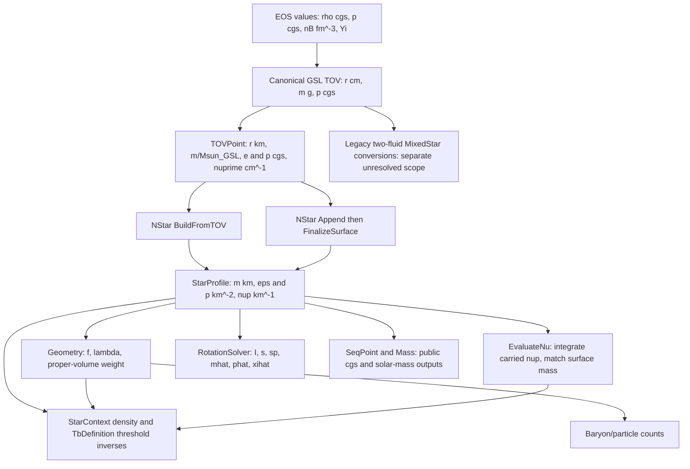

# Relativistic unit-boundary audit — Unit-0

**RELATIVISTIC UNIT-BOUNDARY AUDIT COMPLETE — REPAIR CONTRACT READY FOR OWNER RATIFICATION**

**Candidate recommendation: Option A1**, with one named conversion owner and complete forward,
inverse and public-metadata handling. Preserve the GSL-integrated physical star; derive every
ordinary-StarProfile geometric quantity from that solve's G and c. Preserve the existing public
literal GSL solar-mass ratio separately in the already-existing sequence metadata. A new
TOVPoint geometric payload is useful for a later multi-convention interface but is not necessary
for this minimum correction. ADR-0012 is **PROPOSED**, not accepted. No implementation authority
is inferred from this audit. ADR-0011 remains ACCEPTED; its Q4/PB7 block remains active
(`docs/adr/ADR-0011-particle-number-structural-response.md:92`).

NO UNIT-BOUNDARY PRODUCTION REPAIR, BASELINE REPLACEMENT,
PHASE-5B PARTICLE-NUMBER IMPLEMENTATION, BTILDE, PAPER Z/W,
EVOLUTION, OR BNV IS IMPLEMENTED BY THIS AUDIT.

## 1. Authentication, authority and evidence custody

Starting SHA: `66ace37bd12f85d63fb6381ce5344b9c4dac224e`.
Canonical checkout `/Users/keeper/Documents/CompactStar/repo/CompactStar`, branch `master`,
was clean. HEAD = local master = origin/master = live remote master at entry. The restricted
network query failed DNS; a network-authorized `git ls-remote` succeeded with the exact SHA.
Fresh branch `analysis/unit-boundary-relativity-reconciliation`; fresh worktree
`/Users/keeper/Documents/CompactStar/worktrees/CompactStar-unit-boundary-audit`, authenticated
clean at that same SHA. Other worktrees were inventoried. The all-ref log excluding HEAD had
no unmerged changes to production or the documentation being changed. One agent; no delegation.

Class: **documentation**, with scientific/numerical/architecture analysis and external scratch
experiments. The eventual correction is scientific-semantic, not behavior-preserving engineering
(`GOVERNANCE.md:39`). Governing hierarchy and stop boundary: `GOVERNANCE.md:15`, `:65`, `:88`;
`AGENTS.md:13`, `:82`. Accepted contracts consulted: ADR-0003 runtime provenance, ADR-0004
geometry, ADR-0005 canonical TOV, ADR-0006 angular normalization, ADR-0007 monopole,
ADR-0008 energy measure, ADR-0009 surface, ADR-0011 structural prerequisite. Existing
Phase-4 closeout and Structure-1 original/review/ratification records remain historical authority
within their stated scopes; this report does not rewrite their status.

All scratch source, generated tables, profiles, numerical JSON, build logs and checksums are at
`/private/tmp/unit-boundary-audit`. None is a baseline or a runtime input. The numerical tables
below are generated from `constants.txt`, `residuals.json`, `measure.json`, `summary.json`,
`alternative-clean.json`, `integral-checks.json`, and `oracles.txt` in that directory. Source lines refer to the starting
SHA unless explicitly external. Scratch provenance is a file-backed experiment, not a claim
that these exact decimal outputs will survive a different build or platform.

The fresh Debug build used AppleClang 17, C++17, GSL 2.7.1, Python 3.12.10 with NumPy/SciPy,
and the repository's bundled Zaki/Confind libraries. Build succeeded, with existing compiler
warnings retained in `build.log`. Only the CompactStar library and external audit executables
were built. No production CTest suite was rerun or modified. New source was compiled only
outside Git. Prior preflight scripts were read, adapted and rerun in the fresh directory;
old numerical results were not used as fresh observations. The prior preflight checksum
manifest was also verified: all 21 listed source/result/metadata files passed.

## 2. Exact constants and provenance

`constants.cpp:1` prints both compiled-header and linked GSL versions and linked Zaki constants
at `std::numeric_limits<double>::max_digits10`. GSL definitions actually used are
`/opt/local/include/gsl/gsl_const_cgsm.h:24`, `:25`, `:107`; the build's flags and link command
are retained. The Zaki dependency is the bundled static library, not an assumed live linkage
to the external source tree. External Zaki HEAD is
`b9ddebaded24962468954846f47238aec2726fd4`, clean; its definitions agree with the measured
linked values. The source explicitly notes a March-2022 PDG update
(`/Users/keeper/Documents/CompactStar/external/Zaki/Zaki/Physics/src/Constants.cpp:107`).

| Constant / derived expression | Fresh max_digits10 output |
|---|---|
| GSL_VERSION | 2.7.1 |
| gsl_version | 2.7.1 |
| GSL_CONST_CGSM_GRAVITATIONAL_CONSTANT | 6.6730000000000003e-08 |
| GSL_CONST_CGSM_SPEED_OF_LIGHT | 29979245800 |
| GSL_CONST_CGSM_SOLAR_MASS | 1.9889199999999999e+33 |
| NEWTON_G_SI | 6.6742999999999994e-11 |
| LIGHT_C_M_S | 299792458 |
| LIGHT_C_KM_S | 299792.45799999998 |
| SUN_M_KM | 1.4766250380501249 |
| MEV_2_CM | 1.3238333135663831e-55 |
| MEV_2_INV_FM | 0.0050677307161563949 |
| MEV_FM3_2_G_CM3 | 1782661921627.8979 |
| G_CM3_2_Dyn_CM2 | 8.9875517873681806e+20 |
| MEV_FM3_2_Dyn_CM2 | 1.6021766339999999e+33 |
| INV_FM4_2_G_CM3 | 351767294174610.88 |
| INV_FM4_2_Dyn_CM2 | 3.1615267734966909e+35 |
| INV_FM4_2_INV_KM2 | 0.00026122803039748728 |
| MEV_FM3_2_INV_KM2 | 1.3238333135663829e-06 |
| GEV_2_GR | 1.782661921627898e-24 |
| NEUTRON_M_MEV | 939.56542051999998 |
| PROTON_M_MEV | 938.27208815999995 |
| ELECTRON_M_MEV | 0.51099894999999995 |
| MUON_M_MEV | 105.65837550000001 |
| Lsun | 1.4767161818921166 |
| alpha | 1.0001948149258202 |
| beta | 0.99993827937750712 |

The printed `Lsun` calculation uses `(G*M_sun)/(c*c)*1e-5`; the last bit differs from the
previous `1.4767161818921164` because multiplication by `1e-5` versus division by `1e5`
reassociates floating-point arithmetic. The real-number identity is the same. This is not a
new physical discrepancy. Decimal/high-precision recomputation and the compiled output must
be compared with a rounding allowance, not required to serialize identically.

Independent 70-digit Decimal recomputation from the header's declared decimal constants gives
`Lsun_GSL=1.47671618189211641783546981289849684 km` and
`Lnom=1.47662503805012472962797984014493635 km`. The coherent conversion factors are
`7.4247138240457957979e-34 km/g`,
`7.4247138240457957979e-19 km^-2/(g cm^-3)`, and
`8.2611082525066303557e-40 km^-2/(dyn cm^-2)`.
The mass in grams implied by the nominal solar GM is `1.9887972426195114641e33` under GSL G,
and `1.9884098706980507319e33` under modern G; neither is the GSL solar-mass literal.
These are independent algebraic recomputations, not substitute measurements
(`/private/tmp/unit-boundary-audit/integral_checks.py:1`, `integral-checks.json:1`).

Let `Ce_Z = INV_FM4_2_INV_KM2 / INV_FM4_2_G_CM3` and
`Cp_Z = INV_FM4_2_INV_KM2 / INV_FM4_2_Dyn_CM2`. Then
`alpha = Ce_Z / (G_GSL/c_GSL^2 * 1e10)` and
`beta = SUN_M_KM / (G_GSL*M_sun_GSL/c_GSL^2/1e5)`.
The pressure alpha agrees with the density alpha to rounding; `Ce_Z/Cp_Z = c^2` to about
one ULP. Both geometric-density conversions use modern G to the precision of their stored
literals. Their compatibility with one another does not make them compatible with GSL TOV.
The mass discrepancy is about 61.72 ppm, the energy/pressure discrepancy 194.81 ppm, and their
combination in the mass equation is 256.49 ppm (`constants.cpp:1`; §5 below).

### Metrological meaning — three separate questions

**A — physical-constant authority.** Zaki's G is the modern value `6.67430e-11 SI`; exact c is
`299792458 m/s`. NIST's 2022 CODATA table lists `G=6.67430(15)e-11 SI`, with uncertainty,
whereas the IAU nominal mass parameter is an exact conversion standard, not a measured solar
mass. These distinctions support a future explicit modern-constant decision; they do not
silently amend today's solver. Sources accessed 2026-09-05 local time:
[NIST 2022 constants](https://physics.nist.gov/cuu/Constants/Table/allascii.txt) and
[IAU B3, version 1, 2015-10-26](https://arxiv.org/abs/1510.07674v1).

**B — numerical-solution consistency.** A star integrated using `G=6.673e-8 CGS` must be
represented geometrically using that G. A newer G cannot be applied to just its densities.
The installed GSL 2.7.1 header is exact evidence for the numerical solve. Its G agrees with
[NIST's 1998 CODATA value](https://physics.nist.gov/cuu/Constants/ArchiveASCII/allascii_1998.txt).
The installed GSL manual's general constant-reference section cites CODATA 2006
(`/opt/local/share/info/gsl-ref.info:39689`); it does not establish that every installed macro
has that vintage. In particular the installed G does not equal the 2006 value. The manual's
bibliography is not substituted for the measured header. No primary provenance for GSL's
specific `1.98892e33 g` solar-mass literal was established beyond the installed macro; no
claim is made that it is an IAU nominal mass or a current best estimate.

**C — public unit semantics.** `SUN_M_KM` is explicitly coded as
`1.3271244e17 / LIGHT_C_M_S^2` km with a citation to IAU Resolution B3
(`/Users/keeper/Documents/CompactStar/external/Zaki/Zaki/Physics/src/Constants.cpp:222`).
It represents `(GM_sun)^N/c^2`, with `(GM_sun)^N=1.3271244e20 m^3 s^-2`.
It is not `G_GSL * M_sun_GSL / c^2`. Literal mass ratio and nominal gravitational-parameter
ratio are individually legitimate if named accurately. Combining one as input with the other's
length conversion silently changes meaning. The proposed minimum preserves and explicitly
names the existing literal-GSL public convention; it does not select that historical solar
mass as the ideal measurement standard for all future science.

| Authenticated dependency | SHA-256 |
|---|---|
| dependencies/lib/Zaki/Darwin/arm64/libZaki.a | 3dd4789a20c35064b3133bb863c54c4f64e7df31c94b83201d68f5463902dfef |
| dependencies/include/Zaki/Physics/Constants.hpp | c7a3e1a7a32fd91808f6a1ed130cad0c3caae4643bb00135529060cfeeba719b |
| /opt/local/include/gsl/gsl_const_cgsm.h | a8b38a927e6b2ea8eb7a21079f61cc3f4faaa2373164839c482f4c4fa0ddfc01 |
| /opt/local/lib/libgsl.dylib | 9667d3f90d26c5cfb5229472adf455c0bf6406f946764ad165ec5d4b2121543b |
| /Users/keeper/Documents/CompactStar/external/Zaki/Zaki/Physics/src/Constants.cpp | 4c04d1fef4a59201091cb5cbe041144f4b2efd35237ecd6c44cea1940cee7a61 |

## 3. Directed unit flow and every boundary edge



In the table, a successful algebraic round trip is deliberately distinct from a physically
consistent mapping of the solved spacetime. `Z` denotes Zaki; `S` denotes the GSL constants.

| Source quantity/unit | Conversion expression / owner | Destination/unit | Callers / source evidence | Round trip / physics |
|---|---|---|---|---|
| EOS E [MeV fm^-3] | E*1.602176634e33/c_S^2; Units + GSL c | rho [g cm^-3] | tests/eos/structure1/table.hpp:25 | yes / yes |
| EOS pressure [MeV fm^-3] | p*1.602176634e33; Units | p [dyn cm^-2] | tests/eos/structure1/table.hpp:105 | yes / yes |
| rho,p cgs | same Steffen EOS interpolant; no new units | ODE rho,p cgs | Core/src/TOVSolver.cpp:1490; Core/TOVSolver.hpp:811 | same physical input |
| r [cm] | r/1e5; SI prefix | tp.r [km] | Core/src/TOVSolver.cpp:2591 | yes / yes |
| m [g] | m/Msun_S; GSL | tp.m [literal solar ratio] | Core/src/TOVSolver.cpp:2591 | yes / yes as literal ratio |
| p,rho cgs | identity | tp.p,tp.e cgs | Core/src/TOVSolver.cpp:2591 | yes / yes |
| nuprime [cm^-1] | GetNuDer from physical TOV RHS | tp.nu_der [cm^-1] | Core/src/TOVSolver.cpp:1531 | yes / yes |
| nu | not integrated/published; tp.nu=0 placeholder | tp.nu=0 | Core/src/TOVSolver.cpp:2592 | not an authoritative lapse |
| tp.m [literal ratio] | SUN_M_KM*tp.m; Z nominal GM | profile m [km] | Core/src/NStar.cpp:182,767,782 | algebra yes / physics NO |
| tp.e [g cm^-3] | tp.e*Ce_Z; Z | profile eps [km^-2] | Core/src/NStar.cpp:196,772 | algebra yes / same TOV NO |
| tp.p [dyn cm^-2] | tp.p*Cp_Z; Z | profile p [km^-2] | Core/src/NStar.cpp:191,770 | algebra yes / same TOV NO |
| tp.nu_der [cm^-1] | *1e5; length only | profile nup [km^-1] | Core/src/NStar.cpp:186,768 | yes / GSL field on mixed background |
| nB [fm^-3],Yi | identity | profile nB,Yi | Core/src/NStar.cpp:200,774; INV-01 | yes / yes; ni=Yi*nB |
| r,m [km] | -log(1-2m/r)/2; Geometry | lambda [1] | Geometry.hpp:27; Core/src/NStar.cpp:224,797 | formula yes / wrong m input |
| nup [km^-1],R,M [km] | nu(R)=log(1-2M/R)/2; inward integral | nu [1] | Core/src/NStar.cpp:867 | GSL gradient + nominal-mass surface shift |
| r,m [km] | 4*pi*r^2*exp(lambda); Geometry | wV [km^2] | Core/src/NStar.cpp:311 | formula yes / metric changed by mass conversion |
| profile eps,p,m | divide by Ce_Z,Cp_Z,SUN_M_KM | seq.ec,pc cgs; seq.m solar | Core/src/NStar.cpp:344,356,364,661,675,686 | round trip yes / hides defect |
| profile surface m [km] | /SUN_M_KM | NStar::Mass [solar ratio] | Core/NStar.hpp:294 | current forward/inverse cancel; must migrate together |
| profile eps [km^-2] | *MEV_FM3_2_G_CM3/MEV_FM3_2_INV_KM2 | cached rho [g cm^-3] | Physics/Evolution/src/StarContext.cpp:331 | Z round trip; wrong after forward-only GSL fix |
| envelope rho_b [g cm^-3] | *MEV_FM3_2_INV_KM2/MEV_FM3_2_G_CM3 | profile threshold [km^-2] | Physics/Driver/Thermal/Boundary/src/TbDefinition.cpp:77 | must migrate with profile |
| Omega [rad s^-1] | /LIGHT_C_KM_S; AngularVelocity | Omega_geom [km^-1] | AngularVelocity.hpp:155 | yes / both c values equal |
| I [km^3],Omega [km^-1] | J=I*Omega; normalized Hartle | J [km^2] | Core/src/RotationSolver.cpp:1109 | requires coherent background |
| m0,p0star,xi [km,1,km] | divide by Omega_geom^2 | mhat,phat,xihat [km^3,km^2,km^3] | Core/RotationSolver.hpp:283 | no extra solar factor or physical c^2 |

All shortened source paths in this table are under `CompactStar/` except the explicit test
path. `StarProfile` stores columns and sequence/surface metadata without a second conversion;
its exports print those already-stored units (`CompactStar/Core/StarProfile.hpp:232`, `:353`,
`:381`, `:394`; `CompactStar/Core/src/StarProfile.cpp:28`). Geometry has no G or solar-mass
constant; changing Geometry's equations would put a unit-boundary repair in the wrong layer.

### Repository-wide collateral inventory

The exact requested GSL macros were searched repository-wide, including comments, tests and
generated documentation; the wider alias search under production/main/tests found 188 matching
lines (`conversion-uses.txt:1`). Generated Doxygen copies are historical descriptions, not
additional runtime owners. Relevant non-duplicate live/source families are:

- TOV single-fluid ODE/GetNuDer/publication above; also two-fluid and mantle RHS, diagnostics,
  and legacy TOV-point publication (`CompactStar/Core/src/TOVSolver.cpp:1407`, `:1477`, `:1544`,
  `:3036`). All numerical GSL G/c uses are in that source. The c^2 derivative conversion at
  `:179` uses a Zaki pressure/density ratio; G cancels, so it is consistent to rounding and is
  not the defect. No derivative-policy change is required.
- Every NStar forward and inverse site is listed above, including `Mass()`; changing only
  `BuildFromTOV` would leave Append/FinalizeSurface and the public interface inconsistent.
- MixedStar has parallel forward sites at `CompactStar/Core/src/MixedStar.cpp:330`, `:343`,
  `:368`, `:386`, `:476`, `:491` and inverses at `:270`, `:279`, `:690`, `:701`.
  RotationSolver's remaining solar-length uses at `:457`, `:484`, `:503` are two-fluid exports;
  its legacy explicit c multiplication at `:516`, `:532`, `:541`, `:592` is not the ordinary
  normalized response path. This is inherited, separately unvalidated two-fluid scope.
- Physical EOS-output conversions in `EOS/src/CoulombLattice.cpp:50`, `:66`,
  `EOS/src/Fermi_Gas.cpp:52`, `:74`, `EOS/src/Fermi_Gas_Many.cpp:304`,
  `EOS/src/Polytrope.cpp:44`, `EOS/src/SigmaOmega.cpp:170`, `:198`,
  `EOS/src/SigmaOmegaRho.cpp:771`, `:855`, `EOS/src/SigmaOmegaRho_nstar.cpp:778`, `:862`,
  and `Physics/SigmaOmegaRho_npemu.cpp:771`, `:855` produce physical cgs, not profile
  geometry. They are not rewritten by this correction. Prefix these paths with `CompactStar/`.
- Thermal inverse conversions above are mandatory collateral. Other GeometryCache,
  heat-capacity, neutrino and photon consumers inherit the corrected metric; their equations
  are not changed. The commented conversion in `NeutrinoCooling_Details.cpp:238` is inactive.
- BNV solar-length consumers exist in `CompactStar/Microphysics/BNV/Analysis/src/Decay_Analysis.cpp:412`
  and `Internal/src/BNV_Chi.cpp:2023`, `:2162`, `:2319`; BNV sequence normalization also uses
  SUN_M_KM (`Analysis/src/BNV_Sequence.cpp:616`) and c (`:1057`, `:1085`, `:1104`). These
  historical consumers are inventoried, not activated or certified by an ordinary-NStar repair.
  No BNV result or future readiness follows from this report.
- Synthetic analytic TOVPoints often invert the current Zaki conventions. They are fixtures
  needing explicit migration, not evidence that physical CGS uses Zaki G. The concrete test
  inventory and baseline consequences are in §15.

## 4. Derivation of a coherent solution mapping

Write the physical solution with radius `r_c` in cm, enclosed mass `mu` in g, mass-equivalent
energy density `rho` in g cm^-3, and pressure `P` in dyn cm^-2. For the same numerical G,c:

```
r = r_c / 1e5                                      [km]
m = (G mu / c^2) / 1e5                             [km]
eps = (G rho / c^2) * 1e10                         [km^-2]
p = (G P / c^4) * 1e10                             [km^-2]
nuprime_km = 1e5 * nuprime_cm
```

For an energy rather than mass-density input, replace `rho/c^2` with `epsilon_energy/c^4`.
These formulas follow by nondimensionalizing the physical Einstein/TOV equations, not by
fitting constants to a baseline. Radius itself is the same areal coordinate; only cm versus km
changes. Nu is dimensionless. The canonical solver carries its derivative, then NStar sets
the integration constant using the accepted finite-cutoff surface match.

With `F(m,p;r)=(m+4*pi*r^3*p)/(r*(r-2*m))`, substitution into the physical equations gives

```
exp(-2 lambda) = 1 - 2 m/r
m' = 4 pi r^2 eps
p' = -(eps+p) F
nu' = F
p' = -(eps+p) nu'
```

The first identity alone only checks the mathematical construction of lambda. The fifth alone
only checks that pressure and energy were scaled together. Neither establishes a coherent
background. All five are needed. At the center use regular series/limits; do not divide 0/0.
For tabulated data, pointwise identities apply to the underlying continuous solve; interpolated
profile derivatives incur a separate discretization/rounding error that must be measured.
Source TOV equations: `CompactStar/Core/src/TOVSolver.cpp:1511`, `:1516`, `:1531`.

## 5. Fresh full-star mismatch and radial residuals

Principal fixture: requested `rho_c=1.10e15 g cm^-3`; canonical Structure-1 generator, base
8192 (10375 EOS rows), radial resolution 40000. The fresh table SHA-256 is
`7cd44c92e1e7206e0e68e3fed7e3f0ca68e79ab4517d02b96ff78b9be23d3f1a`, byte-identical to the
prior preflight's finest table. A 4096 table and radial resolution 20000 are separate controls.
Every canonical central/neighbor solve required `SURFACE_REACHED`; each has its own surface,
grid, composition and lapse (`export.cpp:1`; `tests/eos/structure1/table.hpp:48`).

Exports contain the current profile and untouched public TOVPoint values, including zero
`tp.nu`, raw physical pressure/density, radius in cm, and enclosed grams recovered as
`tp.m * M_sun_GSL`. **The private integrator's pre-division mass bits are not publicly exposed.**
That recovered mass is explicitly labelled `m_cgs_recovered`, not claimed byte-identical to
private y[0]; inverse publication may cost an ULP. This is sufficient to distinguish a
1e-4 systematic from roundoff, and independent enthalpy solves provide a separate check.
No instrumentation patch to production was made.

Let `(m_g,eps_g,p_g)` be the same solved state coherently mapped with GSL constants. Current
storage is `(beta*m_g, alpha*eps_g, alpha*p_g)`. Thus

```
(current m')/(4 pi r^2 current eps) - 1 = beta/alpha - 1
current nu' = F(m_g,p_g;r)
current nu'/F(beta*m_g,alpha*p_g;r) - 1 != 0
```

Residual definition below: signed `LHS-RHS`, relative to `abs(RHS)`. The ODE-based derivative
is the physical solved-state RHS transformed with the *same factor as its dependent variable*;
it is not a finite difference and does not claim interpolation error vanishes. Values are
computed across every exported node, including the final pressure-cutoff event
(`residuals.py:1`; `residuals.json:1`).

| Identity | Mixed max abs | r of max abs [km] | Mixed max relative | r of max relative [km] | signed relative there | Coherent GSL max relative |
|---|---|---|---|---|---|---|
| mass | 3.57134860485e-05 | 6.06493163358 | 0.000256485581094 | 12.6169306976 | -0.000256485581094 | 6.36737954311e-16 |
| hydrostatic | 3.16019202817e-10 | 4.48818185883 | 7.33756297388e-05 | 10.8371809518 | -7.33756297388e-05 | 9.98471776801e-16 |
| nuprime | 9.1526303872e-07 | 7.48593143058 | 7.33756297385e-05 | 10.8371809518 | 7.33756297385e-05 | 9.31809685901e-16 |
| pressure_nuprime | 7.62329652529e-21 | 3.85118194983 | 1.3663858846e-15 | 8.19993132858 | -1.3663858846e-15 | 1.31646808404e-15 |
| metric | 0 | 1e-05 | 0 | 1e-05 | 0 | 0 |

Absolute units are respectively 1, km^-3, km^-1, km^-3, and 1. Current m' is uniformly
smaller than its geometric energy source by 256.4856 ppm. Current nuprime is uniformly larger
than the geometric formula (28.42–73.38 ppm); hydrostatic residual relative to the geometric
RHS has the opposite sign. Lambda and the pressure-versus-carried-nuprime identity close even
on the defective background. This explains why narrower existing checks missed the defect.

| Radial regime | Mass relative residual magnitude | Worst nuprime relative residual | r [km] |
|---|---|---|---|
| center | 0.000256485581094 | 2.84223791835e-05 | 0.00997624857625 |
| bulk | 0.000256485581094 | 3.9415651312e-05 | 3.23868203733 |
| muon | 0.000256485581094 | 4.12587328274e-05 | 3.53093199558 |
| neutron | 0.000256485581094 | 7.22498263213e-05 | 12.6431806938 |
| outer_pe | 0.000256485581094 | 7.22481213035e-05 | 12.6449306936 |
| surface | 0.000256485581094 | 7.21434782206e-05 | 12.7534306781 |

The regime masks are `r<.01 km`, bulk `r>=.01,nB>.46`, muon `|nB-.4569848054|<.02`,
neutron `3e-9<nB<2e-8`, outer p-e `nB<7.3567289037e-9`, and last 0.1% of radius.
No threshold is smoothed or treated as a discontinuity atom.

A deliberately separate cubic-spline differentiation of the sampled columns produces worst
relative mass/pressure residuals of order **1.995** near `r=12.64318 km`, for **both** mixed
and coherent profiles, where the derivatives and cell-scale variations are very small/sharp.
For coherent GSL, the worst absolute mass derivative difference is `7.60e-8`, pressure
`2.55e-13 km^-3`. For mixed, worst absolute mass difference is `3.57135e-5`, pressure
`3.16019e-10 km^-3`. The large local spline ratios are not the unit error and are not hidden
by asserting a full-profile derivative tolerance of 1e-15. Production does not use this cubic
spline as its ODE authority. U3 must use conditioned smooth-region derivative or integral-cell
checks, and preserve threshold/error budgets. The primary nuprime algebraic test needs no
profile numerical differentiation and cleanly isolates the defect.

A derivative-free full-star check independently integrates the profile's linearly represented
source using eight-point Gauss quadrature per cell. Define
`m_int(r)=m(r0)+integral 4*pi*r^2*eps dr` and
`p_int(r)=p(r0)-integral (eps+p)*F dr`. Comparing actual stored m,p against these accumulated
integrals yields:

| Representation | max abs mass closure [km] | relative to surface m | max abs pressure closure [km^-2] | relative to central p |
|---|---:|---:|---:|---:|
| Current mixed | 2.36279779148e-4 | 2.56581565661e-4 | 1.89348170236e-9 | 4.66183602195e-5 |
| Coherent GSL | 2.77892319156e-8 | 3.01750940281e-8 | 5.46444382523e-12 | 1.34563243017e-7 |

Mass maxima occur at the surface; the mixed pressure maximum is at 12.5906807013 km,
coherent at the surface. These independent integral checks include interpolation errors and
show that the algebraic RHS diagnosis is not merely a self-cancelling conversion test
(`/private/tmp/unit-boundary-audit/integral_checks.py:1`, `integral-checks.json:1`).

**Conclusion: the current stored background is not one self-consistent geometric TOV solution.**
The mismatch persists independent of resolution. A coherent re-expression restores the
underlying solved-state identities; sampled-profile interpolation remains a numerical
approximation governed separately by INV-13.

## 6. Scratch experiments: representation repair versus actual re-solve

The coherent-GSL experiment calls the **unmodified** canonical TOV once per central state.
An external adapter preconditions temporary TOVPoint inputs so that unmodified NStar's current
conversions yield precisely the desired GSL geometry; NStar/RotationSolver then recompute
lapse, first order and monopole from those columns. Adapter pseudo-solar and pseudo-cgs inputs
are not valid public physical outputs and are never reported as such. Public physical metadata
in this report is from the untouched raw-point copy; the temporary adapter is not a proposed
implementation. In particular the intermediate `meta.tsv` e column on mode 1 is the adapter
value, not achieved physical central density. The authoritative physical exports are the
`rho_cgs`, `p_cgs`, `tp_m` columns (`export.cpp:1`).

The alternative is an **actual independent enthalpy-coordinate re-solve** with
`G=6.67430e-8 CGS`, exact c, and the same physical Track-R free-gas model and central rho.
It uses phase-space quadrature and equilibrium roots directly, not the generated EOS
interpolant, which also supplies an independent EOS/table check. It integrates
`u=r^2`, `z=m/r^3`, and each species count with DOP853 to both the matching finite cutoff and
vacuum. With enthalpy `H=log(h/h0)`, `t=Hc-H`, its equations are

```
Fh = (1-2uz)/(z+4*pi*p)
du/dt = 2 Fh
dz/dt = (4*pi*eps-3z)*Fh/u
dNi/dt = 4*pi*sqrt(u)*ni*Fh/sqrt(1-2uz)   [counts in 1e54]
```

An independent GSL-constant version of that same solver provides a control. Both were
actually integrated; neither is a rescaling of a pre-existing GSL solution. Their first-order
and monopole response is independently integrated on the dense continuum background; the
monopole uses `(mhat,hhat)` and the first integral for phat. Count/response quadratures use
explicit n,p,e,mu ordering and proper volume. Complete neighboring stars own their own cutoff
`max(1e-15 P_c,P_floor)`; the free-gas floor is below the active cutoff here.
(`alternative.py:1`, `direct.py:1`; independent source formulation:
`tests/rotation/hartle_monopole_reference.hpp:14`.)

A cross-check, **after** those re-solves, follows from fixed-physical-EOS homology at fixed c.
Writing `g=G_new/G_old`, at the same central physical state,
`r,m_geo,Rinf ~ g^(-1/2)`, `m_grams,N,I_geo ~ g^(-3/2)`,
`eps_geo,p_geo ~ g`, and `A,K,B_epsilon ~ g^(-5/2)`.
At common fractional radius `nu,lambda,s` and compactness are unchanged; `s'~g^(1/2)`,
`phat~g^(-1)`, `mhat,xihat,deltaMhat~g^(-3/2)`. These scaling identities validate the
independent numerical alternative; they do not replace it. A change of central control,
EOS, c, or physical cutoff rule would require revisiting this homology.

## 7. Public mass semantics

Current `tp.m = mu/M_sun_GSL`, not `(Gmu)/(GM_sun)^N`
(`CompactStar/Core/src/TOVSolver.cpp:2591`). A nominal mass is instead
`M_nom = m_geo/SUN_M_KM`. For the same GSL star these differ by `1/beta`, about +61.724 ppm.
Multiplying the literal ratio by SUN_M_KM cannot yield the mass length that solved the star.

Recommended public contract: retain the existing literal ratio, explicitly documented as
`mu/(1.98892e33 g)`, while the geometric mass is `G_S mu/c_S^2`. Preserve `tp.m` into
`SeqPoint::m` and the public NStar mass result, and store geometric mass independently in the
existing profile column/surface scalar. This is scientifically justified by keeping reporting
normalization separate from the invariant spacetime, not merely by an old regression file.
`SeqPoint` and `StarProfile::MassSurface()` already provide separate places
(`CompactStar/Core/StarProfile.hpp:353`, `:381`, `:394`). No new TOVPoint member is necessary.

A2's explicit geometric payload would be preferable if arbitrary solver conventions were to
cross this public boundary, especially with nominal reporting alongside a different G.
For the current single, explicitly governed canonical solver, A1 converts from completely
specified existing physical semantics without ambiguity. Old unlabelled geometric exports
must not be fed into a new calculation as though newly certified; future import support must
reject/explicitly convert historical conventions. No silent heuristic recognition of old data.

## 8. Pressure, energy, nu and thermal inverses

Use one owner for `grams -> mass length`, `mass density -> km^-2`, `pressure -> km^-2`,
and the corresponding inverse formulas. Conceptual operations such as
`MassLengthFromGrams`, `MassDensityToInvKm2`, `PressureToInvKm2` must all refer to the selected
solve's G,c; no names are implemented here. Zaki's precomputed factors are safe only for a
solve with that same convention, not because they carry the right dimensions.

Carry nuprime through the exact cm/km conversion. Reconstruct nu with the corrected geometric
surface mass using the existing inward integral. On the midpoint the whole nu array shifts by
`-5.2030974704e-6`; its derivative does not change. Lambda and proper-volume weight do change.
The correction is to the input mass, not to the Schwarzschild formula or integration method
(`CompactStar/Core/src/NStar.cpp:906`).

The two thermal inverse sites are part of the minimum complete repair. Otherwise a corrected
profile would yield a cached physical density about `1/alpha-1 = -1.94777e-4` too low, and
an envelope-density threshold in a different convention. Preserve physical rho and threshold
meaning through the same owner (`StarContext.cpp:331`, `TbDefinition.cpp:77`, fully qualified
paths in §3). This does not authorize thermal-model or evolution-equation changes.

## 9. Options, A/B/C separation and recommendation

For every coherent option, the decisive closure requirement is the five identities of §4.
Changing a public mass denominator alone or changing only a solar-length factor does not close
all of them. No option may loosen PB7 or insert compensating factors in RotationSolver.

| Option | Scientific disposition (A/B/C) | Scope and public API | Baseline / reproducibility / silent-mixing risk | PB7 and future EOS |
|---|---|---|---|---|
| A1 — RECOMMENDED | A: defer modern-G migration; B: preserve exact canonical solve; C: explicit literal public mass, separate geometry | One conversion owner; both NStar paths and inverse consumers; existing schema; copy public metadata | Affected profile-dependent artifacts superseded after validation; unchanged TOV remains reproducible; guards must cover every inverse | Scratch <=1.37e-6; model-independent physical-CGS boundary suits realistic EOS |
| A2 | Same A/B as A1; C: solver additionally supplies authoritative geometric payload | New TOVPoint fields/type and producer/consumer contracts, fallback/refusal rules; more fixtures | Same scientific baseline shifts as A1; reduces reconstruction ambiguity; duplicate payload needs consistency checks | Closes if complete; preferable for multiple solve conventions, larger than necessary now |
| A3 — existing dual metadata variant | Included in A1: copy raw tp public mass/ec/pc to existing SeqPoint; store geometry separately | No new schema; eliminates inverse public reconstruction where physical values already exist | Avoids needless public round-trip drift; remaining physical inverses still use owner | Part of the recommended A1 contract, not a second recommendation |
| B — modern G/nominal mass | A: defensible modern constants; B: genuinely new solved star; C: must choose nominal versus literal explicitly | Changes TOV G and perhaps public mass normalization; current Zaki conversion literals still need precision checks | All static/rotation/thermal validations revisit; strongest historical numeric migration; no baseline argument against valid modern physics | Scratch also closes, but adds independent physical change unnecessary for Q4 |
| C — migrate both to new authority | A/B/C depend on selected values, not class name | If GSL selected, boundary-only form reduces to A1; global routing of every G alias is a larger refactor | Centralization helps future prevention; broad EOS/BNV/two-fluid migration adds unauthorized risk | No scientific advantage to changing additional equations/owners now |
| D — two tagged conventions | Safe only if a whole background and all inverses use its tag; reject mixed tuple before equations | Adds metadata, dispatch, import and persistence semantics; no mixed RotationSolver equations | Reproducible historical records; more migration/version testing; tags alone cannot repair current invalid tuple | Viable for future coexistence; unnecessary for one canonical convention |
| E | No smaller scientifically complete alternative found | Three forward literal substitutions alone omit public and thermal inverse boundaries | Rejected as incomplete; cannot treat existing round trips as physics evidence | Must satisfy the same U3/U13 gates |

**Exactly one recommended repair: A1 with existing dual public/geometric metadata (A3 above).**
It changes no physical EOS, TOV G/c, central selection, surface policy, rotation equation,
angular normalization, or chemical convention. It repairs all ordinary-profile mappings and
known physical inverse consumers. Scientific consistency uniquely requires the existing
solve's constants if its physical solution is preserved. A modern-G migration is a separate
physical decision, not necessary to repair the representation. Choosing the smallest current
contract is not a claim that the legacy G is the best physical estimate.

## 10. Structure-1 impact and qualified published claim

All rows use requested central physical `rho_c=1.10e15 g cm^-3`. The finite-cutoff canonical
GSL mass/radius are unchanged by representation repair. R0/Rinf require the explicit vacuum
tail or independent full solve; Rcut is never called the zero-pressure radius.

| Calculation | Mass / convention | Rcut [km] | R0 [km] | Rinf,0 [km] | 2m/Rcut | Printed-bin result |
|---|---|---|---|---|---|---|
| Current mixed storage | 0.623635569063 literal GSL | 12.7661747607 | 12.768154901 | 13.8023680741 | 0.144268101159 | 0.62 / 12.77 / 13.80 |
| Same GSL solve, A1 representation | 0.623635569063 literal GSL | 12.7661747607 | 12.768154901 | 13.8024398763 | 0.144277006026 | 0.62 / 12.77 / 13.80 |
| Independent GSL re-solve | 0.623635569137 literal GSL | 12.7661747583 | 12.768154901 | 13.8024398765 | 0.14427700607 | 0.62 / 12.77 / 13.80 |
| Independent modern-G re-solve | 0.623453373053 literal GSL | 12.7649314193 | 12.7669113692 | 13.801095612 | 0.144277006029 | 0.62 / 12.77 / 13.80 |
| Same modern-G result, nominal report | 0.623613320878 nominal GM ratio | 12.7649314193 | 12.7669113692 | 13.801095612 | 0.144277006029 | 0.62 / 12.77 / 13.80 |

The printed bins remain `[.615,.625)`, `[12.765,12.775)`, `[13.795,13.805)`.
No mass fit, source-bin widening, or EOS tuning was performed. The A1 R0 is the independent
tail/control value, not an unmodified public NStar field. The canonical finite-cutoff mass
omitted by the tail is negligible here; the independent GSL re-solve separately checks it.
The ~1.980 m tail remains explicit. Modern G reduces R0 by about 1.244 m; under the fixed
literal mass denominator its mass decreases by about 292.15 ppm. Under nominal GM reporting
both the G change and the reporting denominator must be named.

**The qualified common-state Table-1 claim survives each evaluated coherent convention.**
This is an audit recheck, not a re-ratification of migrated production. The unresolved
source-qualified maximum-before-Sigma selection remains unresolved; the three printed numbers
at this one state do not reproduce a continuous supremum. Binding qualification:
`docs/validation/TRACKR_FREEGAS_WHOLESTAR_STRUCTURE1_RATIFICATION.md:39`, `:49`, `:68`.

## 11. First-order and monopole effects

The following are freshly recomputed responses on the *same physical canonical stars*, current
mixed versus coherent GSL. No source or baseline was edited. DS(CMF)-1 uses the current
four target-mass workflow states, default radial resolution 10000. The 1.0-Msun fixed-center
re-solve differs from the exact baseline at ~1e-11 relative because the exported first-node
rho was reused as a requested center; 1.4/1.6/2.0 rows reproduce the baseline response values
at serialized precision. This minute 1.0-row reconstruction difference is recorded, not
folded into the unit effect. EOS hash/producer authority:
`docs/validation/PHASE4D_MONOPOLE_BASELINE.md:56`, `:67`, `:135`.

| Star | I mixed -> coherent [km^3] | deltaMhat mixed -> coherent [km^3] | relative I | relative deltaMhat | relative baryon count |
|---|---|---|---|---|---|
| g8192r40000 | 31.4397161287 -> 31.4343353157 | 473.602592803 -> 473.55976859 | -0.00017114699515 | -9.04222527367e-05 | 4.80237617606e-06 |
| ds1.000000 | 86.9957583816 -> 86.9816197239 | 995.258696178 -> 995.174057303 | -0.000162521230288 | -8.50420852986e-05 | 6.05480718696e-06 |
| ds1.400000 | 135.616130613 -> 135.596010961 | 940.92203664 -> 940.861470947 | -0.000148357364332 | -6.43684495806e-05 | 9.14437469501e-06 |
| ds1.600000 | 159.587141588 -> 159.564812264 | 865.866051615 -> 865.817993625 | -0.000139919321456 | -5.55027999162e-05 | 1.11289196343e-05 |
| ds2.000000 | 193.72211615 -> 193.699896973 | 573.868836251 -> 573.841682105 | -0.000114696130006 | -4.73176881057e-05 | 1.78758333331e-05 |

| Star | surface mhat relative | surface phat/xihat relative | surface delta-phat/shell relative | max norm s | max norm s-prime |
|---|---|---|---|---|---|
| g8192r40000 | -9.01693662557e-05 | 9.39139388454e-05 | -0.000100881333785 | 4.00601462045e-05 | 0.000159112154094 |
| ds1.000000 | -8.4285957452e-05 | 0.000124961316125 | -6.98400038203e-05 | 4.58839494537e-05 | 0.000159483135425 |
| ds1.400000 | -6.2527143712e-05 | 0.000127236995653 | -6.75647675425e-05 | 5.8752314555e-05 | 0.000144670621096 |
| ds1.600000 | -5.27723503247e-05 | 0.00012477929545 | -7.00219890415e-05 | 6.44294525785e-05 | 0.000135989042955 |
| ds2.000000 | -4.13376993385e-05 | 8.06331362728e-05 | -0.000114159549563 | 7.28511585866e-05 | 0.000110289566487 |

For fields which vanish centrally, the full-profile norm is `max|new-old|/max|old|`, not an
ill-conditioned central pointwise ratio. Full mhat/phat/xihat and lambda norms plus all surface
values are retained in `summary.json:1`. At the midpoint, max normalized phat/xihat changes
are `9.39139e-5`; at DS 2.0 the phat norm is `1.45549e-4` and xihat `1.11740e-4`.
`delta-phat=(eps+p)*phat`, `xihat=phat/nup`,
`shell=4*pi*R^2*eps_surface*xihat`, and
`deltaMhat=mhat_surface+shell+I^2/R^3` are recomputed, not rescaled by a guessed unit factor
(`CompactStar/Core/src/RotationSolver.cpp:1557`, `:1569`, `:1601`, `:1606`).

J/Omega is I and changes by the same fraction. Omega_phys/Omega_geom conversion is unchanged
because c is identical. A physical inertia could be rendered as `I_cgs = I_geo*1e15*c^2/G`
and J as `J_cgs=J_geo*1e10*c^3/G`, but no new physical-I/J public API is proposed by this
minimum repair; ADR-0006's deferred cgs interface remains separate.
Fixed-central-energy normalization remains the same physical constraint under a constant
conversion factor: holding rho_c is equivalent to holding eps_c at fixed G,c. The numerical
eps_c label changes by 1/alpha; this is accounted for explicitly in B_epsilon, not in q.
No homogeneous admixture or fixed-baryon rotation normalization is introduced.

### Independent rotation checks and what the old validation proves

External `oracles.cpp:1` invokes the existing independent conservative first-order solver
(`tests/rotation/hartle_reference.hpp:171`) and `(mhat,hhat)` Stieltjes oracle with four
subintervals per profile interval (`tests/rotation/hartle_monopole_reference.hpp:577`).
It consumes exported backgrounds; it never calls the production rotation RHS. This is a
re-evaluation of available independent methods, not a replacement baseline.

At the midpoint, I from the independent flux formulation is `31.4395152117` on mixed geometry,
`31.4343352495` on coherent GSL versus recomputed production-form `31.4343353157` (relative
about 2.1e-9). The independent volume result is `31.4343330739`, with its distinct quadrature
floor. Stieltjes deltaMhat is `473.559494163` versus `473.559768590`, about 5.8e-7 relative;
independent direct-EOS/enthalpy `(mhat,hhat)` gives `473.559463917`. Those differences are
smaller than the 9.0e-5 unit effect but not zero, and are not evidence for extra significant
digits. On the four coherent DS stars, independent flux I differs from the production-form
value by at most about 5.25e-6; Stieltjes deltaMhat differences are about 1.8–2.0e-7.
Full output is `oracles.txt:1`.

The current equation/normalization/measure tests remain useful independent evidence. In
particular analytic fixtures built by inverse-Zaki conversion supplied internally coherent
*manufactured* geometry, so they never tested the physical GSL publication boundary. The
real-star oracles frequently shared the same background, and could verify rotation integration
on that background while missing its inconsistency. Thus **baseline supersession alone is
insufficient**: revalidate the static input identities and then the independent Hartle chains,
including analytic, measure, published-model and convergence controls. No defect requiring a
RotationSolver equation change was found. No existing historical VERIFIED record is silently
withdrawn or extended here; migrated production needs a fresh scoped validation record.
Existing oracle limitations and the accepted D-prime envelope remain binding
(`docs/validation/PHASE4D_CORRECTED_MONOPOLE_REVALIDATION.md:100`, `:111`, `:134`, `:602`).

The independent modern-G re-solve gives I `31.4251496274 km^3` and deltaMhat
`473.421113167 km^3`, consistent with the physical homology. Those are different physical-star
results, not the impact of A1.

## 12. PB7 closure experiment and central-step conditioning

Complete-star B uses the accepted Q3 coordinate `x=ln(rho_c/1.10e15)`. Neighboring complete
canonical stars at x=±.0005,±.001,±.002 have independent grids, metrics, compositions and
cutoffs. Five-point estimates use `[8(N(h)-N(-h))-(N(2h)-N(-2h))]/(12h)`; h=.0005 and .001
are retained. B_epsilon is Bx divided by the *same-convention* achieved central eps.
The independent regular homogeneous equations use an energy measure, with
`m_h(r0)=4*pi*eps_c*r0^3/3`, `ph_h(r0)=eps_c/((eps_c+p_c)*dedp_c)` for delta ln eps_c=1.
Each homogeneous calculation uses the same whole background convention as its count measure;
unlike the old calibration control, no mass-derivative conversion back to mixed geometry is
needed (`measure.py:1`, `analyze.py:1`).

| Species | Mixed complete Bx /1e54 | Mixed homogeneous Bx /1e54 | signed relative error | Coherent GSL complete Bx /1e54 | Coherent GSL homogeneous Bx /1e54 | signed relative error |
|---|---|---|---|---|---|---|
| n | 132.757267479 | 132.635473337 | -0.000917419769391 | 132.759760953 | 132.75957928 | -1.3684310588e-06 |
| p | 4.70539635494 | 4.70438807582 | -0.000214281442273 | 4.70542310046 | 4.70541973461 | -7.15311926358e-07 |
| e | 4.24107478511 | 4.24008053235 | -0.000234434150749 | 4.24110102964 | 4.24109766968 | -7.92237492497e-07 |
| mu | 0.464321569811 | 0.464307543474 | -3.02082394303e-05 | 0.464322070814 | 0.464322064926 | -1.26807604417e-08 |

| Independent direct-EOS re-solve | n PB7 error | p PB7 error | e PB7 error | mu PB7 error |
|---|---|---|---|---|
| gsl | -7.43802860603e-06 | -1.81671040778e-06 | -1.48204631234e-06 | -4.87351554679e-06 |
| zaki | -6.07657738794e-07 | -1.79728678096e-06 | -1.46091886544e-06 | -4.86966336832e-06 |

The leading mixed discrepancy freshly reproduces ~9e-4. Coherent canonical-profile GSL
reduces it to **1.36843e-6** (other species <=7.93e-7). The prior ~9.74e-7 was a differently
calibrated mixed-count diagnostic, not an identical definition; this audit uses coherent
geometry in both count methods. The alternative coherent solve is also comfortably below
the **pre-existing proposed 2e-4** independent-method target. These results demonstrate
sufficiency in principle; **PB7 IS NOT DECLARED PASSED** because there is no accepted and
validated production repair.

The 4096-to-8192 canonical table change is at most `2.923e-6` in Bx, about `5.07e-8` in N,
`4.56e-8` in A, and `2.26e-8` in K. The two fine central-step estimates differ by at most
about `3.31e-7` relative. Independent direct-EOS five-point Bx has a larger neutron
step/noise envelope (~1.45e-5 for the modern-G row); the displayed sub-1e-6 neutron
comparison there is therefore **not** claimed accurate to that many digits. Its method error
remains below the 2e-4 target. At midpoint radial 20000->40000, I changes by 2.02e-7 and
surface mhat by 9.21e-8 under either mapping. These envelopes are reported separately from
constant-factor errors and may not be used to choose final tolerances by fitting the result.

## 13. N / A / B / K consequences and cancellation

All counts below use the explicit unit factor 1e54 for fm^-3*km^3. A and K have units
count km^2; B is count km^2 per numerical eps in km^-2. Displayed numbers are divided by 1e54.
No coefficients are promoted to a baseline or to FR2005 core I_Omega.

| N [count] | Mixed /1e54 | Coherent GSL /1e54 | relative change |
|---|---|---|---|
| n | 756.82753225 | 756.831171406 | 4.80843417283e-06 |
| p | 4.85947912278 | 4.859497875 | 3.85889465382e-06 |
| e | 4.81190192657 | 4.81192064114 | 3.88922506334e-06 |
| mu | 0.0475771962077 | 0.0475772338561 | 7.91312319448e-07 |

| A [count km^2] | Mixed /1e54 | Coherent GSL /1e54 | relative change |
|---|---|---|---|
| n | 396434.383632 | 396477.259651 | 0.000108154137279 |
| p | 1840.27127383 | 1840.48287188 | 0.00011498199153 |
| e | 1829.04340433 | 1829.25369459 | 0.000114972811431 |
| mu | 11.227869498 | 11.2291772916 | 0.000116477448888 |

| B_epsilon [count km^2] | Mixed /1e54 | Coherent GSL /1e54 | relative change |
|---|---|---|---|
| n | 162517.937409 | 162552.651369 | 0.000213600788196 |
| p | 5760.22183056 | 5761.37675529 | 0.000200500042634 |
| e | 5191.81163912 | 5192.85521564 | 0.000201004310797 |
| mu | 568.410191423 | 568.521539645 | 0.000195894134952 |

| K [count km^2] | Mixed /1e54 | Coherent GSL /1e54 | relative change |
|---|---|---|---|
| n | 11792.8132103 | 11793.904045 | 9.24999589611e-05 |
| p | -11792.8132103 | -11793.904045 | 9.24999589615e-05 |
| e | -10458.7484176 | -10459.7182336 | 9.27277374254e-05 |
| mu | -1334.0647927 | -1334.18581141 | 9.0714266644e-05 |

| Species | K cancellation condition, mixed | K cancellation condition, coherent |
|---|---|---|
| n | 66.2332168012 | 66.2342691846 |
| p | 1.31210047018 | 1.31210748618 |
| e | 1.34976334286 | 1.34977112265 |
| mu | 1.01683256999 | 1.01683300361 |

Condition number is `(abs(A_i)+abs(B_i*A_B/B_B))/abs(K_i)`. The neutron cancellation is
about 66.23, so a relative ingredient tolerance cannot be copied unchanged onto K. B_B must
remain conditioned and no fallback denominator is allowed. The coherent result has
`dx/dq=-2897.58999899 km^2`; the mixed value is `-2897.32967337 km^2`.
The relative changes of Bx are only `1.87822e-5, 5.68401e-6, 6.18818e-6, 1.07900e-6`;
B_epsilon additionally changes because central geometric eps decreases by 1/alpha.
Thus comparing B without naming its differentiation coordinate would be misleading.

N changes because the previous count used a different metric; this is a correction to the
computed measure of the original physical star, not a change in its EOS or CGS TOV solution.
A and K change because both geometry and recomputed Hartle fields change. They cannot be
repaired by multiplying an old response by one constant. Under an actual modern-G re-solve,
N changes physically by ~-292.15 ppm and A/K by ~-486.87 ppm relative to a coherent old-G
solution, subject to the independent numerical envelope (§6). The independent modern-G N/A/B/K
vectors and conditions are retained in `alternative-clean.json:1`, with its real re-solve
rather than homology-only provenance.

## 14. Static, thermal and other downstream effects

For A1 the physical CGS solved star, raw public mass, Rcut, central state and EOS composition
are invariant. The correct geometric m,eps,p,compactness,lambda and lapse replace inconsistent
representations; nuprime remains unchanged. A pure unit relabelling of an already coherent
star would leave dimensionless observables/counts invariant, but that is not the current case.

At the midpoint the maximum proper-volume weight increase is `6.54032e-6`; the largest
relative change of `wV*exp(2nu)` is `1.04061e-5`. For DS 1.6 those are `1.78698e-5` and
`3.33388e-5`; for DS 2.0 `2.85531e-5` and `5.35354e-5`. Surface and local temperature
redshifts therefore change, as do metric-weighted cooling quantities. `T_local=Tinf*exp(-nu)`
increases at fixed Tinf. Nonlinear thermal temperature powers can amplify this small shift;
these weight figures are **not** asserted as bounds on an entire cooling trajectory.

The physical-density inverse and envelope threshold must remain matched to the new profile,
otherwise they introduce an additional ~1.95e-4 error (§8). Composition and direct-Urca
kinematic species fractions do not change at a fixed solved star; a density-selected layer can
change if its conversion is left stale. GeometryCache provenance must be regenerated from
fresh profile identity/version, as ADR-0003 requires. Existing heat capacity, neutrino/photon
luminosities and the three thermal artifacts require assessment/revalidation. No new thermal
evolution or BNV calculation was begun; full cooling trajectories were **not** simulated in
this audit. Their exact shifts are future U11 evidence, not invented here.

## 15. Baseline and test/validation impact matrix

Classification is for the recommended A1. A representation-only field may sit in an artifact
whose scientific numerical expectation must be superseded. Current hashes are preserved in
`starting-file-hashes.json:1` and checked again at delivery. Canonical eight-artifact authority:
`docs/validation/PHASE4D_MONOPOLE_BASELINE.md:250`.

| Artifact in tests/baselines | Classification / fields | Required disposition |
|---|---|---|
| passive_cooling_cmf_1p6_debug.tsv | REQUIRES INDEPENDENT REVALIDATION; MUST BE SUPERSEDED / RE-RATIFIED | Metric/lapse and density-threshold consistency affect thermal output; preserve placeholder-neutrino disclaimer; U11 then exact producer |
| tov_dscmf1_reference.tsv | UNAFFECTED under A1 | Only public literal mass/radius comparisons and Mmax; expected bytes remain; U7 proves it |
| grid_convergence_cmf_1p6_debug.tsv | REQUIRES INDEPENDENT REVALIDATION; MUST BE SUPERSEDED | M,R,physical center unchanged; compactness/lapse are REPRESENTATION-ONLY CHANGE; B and thermal numbers change |
| grid_convergence_cmf_1p6_trajectory.tsv | REQUIRES INDEPENDENT REVALIDATION; MUST BE SUPERSEDED | Thermal trajectories depend on corrected metric; re-evaluate numerical convergence, not just emitter |
| hartle_I_dscmf1_debug.tsv | NUMERICALLY CHANGED; REQUIRES INDEPENDENT REVALIDATION; MUST BE SUPERSEDED | I and derived Ibar/compactness affected; equations may retain scientific claim after U8 |
| baryon_number_dscmf1_reference.tsv | NUMERICALLY CHANGED; MUST BE SUPERSEDED after independent measure validation | N_B proper volume changes; count definition remains same |
| tov_path_equivalence_dscmf1.tsv | UNAFFECTED relational expectation under A1; revalidate | Contains differences/equality of both paths, fixed physical centers, node counts; all-zero equality can stay byte-identical when both paths migrate |
| hartle_monopole_dscmf1_debug.tsv | REQUIRES INDEPENDENT REVALIDATION; MUST BE SUPERSEDED / RE-RATIFIED | I,mhat,phat,delta-phat,xihat,shell,deltaM change; preserve physical background metadata; U9 then producer |

Six artifacts require supersession; two are expected to retain bytes after revalidation.
Do not rewrite unchanged artifacts just to make all timestamps or provenance anchors look new.
For B with changed G, even static and target-mass-dependent tables need reconsideration;
path-equality itself remains the required invariant but fixed centers and sampling can change.

Non-baseline tests and validation records to inspect/migrate in the future repair:

| Family / concrete files under tests | Effect / retained oracle |
|---|---|
| `core/tov_surface_contract.cpp:223,299,424`; `eos/rotochemical_trackr_freegas_structure.cpp:64` | Replace nominal reconstruction from public literal mass; surface/cgs event equations unchanged; keep independent raw-GSL calculation |
| `eos/eos_derivative_contract.cpp:203,220` | Analytic synthetic TOVPoint inverse conversion must use the declared new physical convention; central derivative authority unchanged |
| `rotation/hartle_profile_compare.hpp:123`, `hartle_moment_inertia_analytic.cpp:135`, `hartle_normalization_contract.cpp:181` | Update fixture adapters, preserve independent exact Schwarzschild geometry and exact-c spin oracle |
| `rotation/hartle_monopole_contract.cpp:169`, `hartle_monopole_measure_contract.cpp:185`, `hartle_monopole_physics_analytic.cpp:168`, `hartle_monopole_published.cpp:148` | Same fixture migration; retain independent series, jump, constant-density, published dimensionless targets |
| `rotation/hartle_monopole_physics_cmf.cpp:242,467,858`; `rotation/eos_table_knots.hpp:48` | Physical pressure/energy/sequence oracles must use matching convention; no fitted tolerance, no shared production helper for independent constants |
| `rotation/hartle_moment_inertia_cmf.cpp:225`, `hartle_first_order_physics_cmf.cpp:189`, `hartle_normalization_cmf.cpp:172` | Compactness/Ibar/Kepler normalization must use actual geometric mass, not public mass times nominal length |
| Core baryon/path/grid tests, thermal heat-capacity/cache/photon/neutrino/passive-cooling tests | Constants/physical inverse fixtures plus updated metric; retain independent measure/provenance/thermal-law assertions |
| EOS Track-R local thermodynamics/free-lepton tests and AngularVelocity-only tests | Physical local EOS/c-only semantics unaffected; ordinary regression remains required |
| BNV, MixedStar and uncompiled legacy RotochemicalCache | Inventoried but no readiness or activation; separate authority/coverage before migration |

Existing records whose numerical real-star content needs a forward supersession pointer in a
later authorized repair: `TOV_REFERENCE`, `TOV_PATH_EQUIVALENCE`,
`HARTLE_MOMENT_INERTIA`, `PHASE2B_CLOSURE` (including baryon number),
`GRID_CONVERGENCE`, `PASSIVE_COOLING_BASELINE` and thermal migration records,
`PHASE4A_FIRST_ORDER_NORMALIZATION`, `PHASE4B_FIRST_ORDER_PHYSICS`,
`PHASE4C_I0_EOS_DERIVATIVE` (unit examples/fixtures),
`PHASE4C_I1_MONOPOLE_IMPLEMENTATION`, `PHASE4D_CORRECTED_MONOPOLE_REVALIDATION`,
`PHASE4D_MONOPOLE_BASELINE`, `PHASE4_CLOSEOUT`, the three Structure-1 records, and
`PHASE5B0_INV09_GLOBAL_RESPONSE_PREFLIGHT` (diagnostic N/A/B/K only).
Historic content is preserved; no retrospective conversion of a past failure or validation into
a different experiment. This audit edits none of those records except its allowed pointers.

## 16. Governance and baseline supersession chronology

Yes: the current profile is demonstrably internally inconsistent (§5), and preserving its
mixed output as scientific truth would entrench that defect. Existing baselines remain valid
**historical regression records**, not independent scientific authority for the rejected
mapping. `GOVERNANCE.md:88` defines the narrow exception; an ACCEPTED defect-specific ADR
must name the minimum correction, independent evidence, historical outputs and immediate
post-validation baseline. ADR-0011 Q4 explicitly does not select the correction or authorize
that exception (`docs/adr/ADR-0011-particle-number-structural-response.md:117`).

ADR-0012 proposes that authorization but **cannot exercise it while PROPOSED**. This is a
scientific correction with existing baselines to supersede, not a claim that none exist.
The same evidence principle applies: independent algebra, TOV identities, exact analytic
stars, independent integrators, convergence, published dimensionless tests and homogeneous
versus complete-star methods substitute for agreement with rejected output. The old reference
bytes remain in Git history and in the audit hashes. No test should redefine a wrong result
as correct by widening its regression tolerance.

Required chronology:

1. Owner ratifies the explicit ADR-0012 decisions and correction/supersession authority.
2. In a separately authorized task, implement the named minimum with unchanged canonical
   physical TOV outputs; add independent unit/mixed-convention detectors.
3. U1–U7 static conversion, identity, path, analytic and qualified Structure-1 revalidation.
4. U8–U11 first-order, monopole, count and thermal revalidation; carry original tolerances and
   accepted D-prime convergence logic. Obtain independent review and scoped owner ratification.
5. Immediately after the relevant corrected quantities are independently validated, create
   the six superseding reference artifacts from their canonical producers, with repeated
   identical bytes and explicit prior/new hashes (U14). Preserve the other two when unchanged.
6. U12 PB7 coherent homogeneous/complete-star comparison, including step/table/tail budgets,
   and confirmation of U13 stale/mixed rejection. This completes the separate unit prerequisite
   only after review/owner acceptance; it does not itself close INV-09.
7. Only after accepted correction, revalidation, supersession and Q4 completion may a separately
   authorized Phase-5B production task begin. PB1–PB14 remain required for INV-09 closure.

This respects `GOVERNANCE.md:109` rather than creating reference output before physics
validation. U12 may be run diagnostically earlier, as here, but cannot waive steps 1–5.
INV-09 remains **INTENDED BUT UNVERIFIED** and INV-11 **UNRESOLVED** throughout this audit.

## 17. Proposed ADR-0012 and owner decisions

A new ADR is required: this selects the ordinary-profile relativistic convention and scopes
supersession of cross-layer numerical expectations. `docs/adr/ADR-0012-relativistic-unit-boundary.md:1`
is **PROPOSED**. It contains five concrete owner decisions: preserve the GSL solve, use one
matched geometric mapping, retain explicitly named literal public mass separately, adopt A1
with all inverse consumers, and authorize the staged six-artifact correction/supersession.
Alternatives B/A2/D are genuine future choices, not implemented defaults.
The recommendation is decisive for minimum repair; owner acceptance is still required by the
scientific change procedure. No request to choose a G from a baseline's convenience is made.

## 18. U1–U14 eventual validation ladder

These are requirements for the eventual repair, **not fourteen passed tests in this audit**.
Scientific tolerances must precede implementation results and be derived from exact algebra,
source precision, existing approved bounds and an independently measured error budget.

| Gate | Independent oracle | Metric / tolerance basis | Defect falsified |
|---|---|---|---|
| U1 | Compiled dependency probe, source hashes, installed GSL header, IAU/NIST provenance | Exact declared decimal values/versions; rounding <= operation-count ULP allowance; no silent dependency vintage change | Wrong library/header, nominal mass mistaken for G*M |
| U2 | High-precision independent cgs/geometric algebra, exact SI prefixes | Round-trip error bounded from floating-point operation count across magnitude range; independent literal oracle, not production helper | Missing c^2,c^4,cm/km powers, pressure versus mass-density confusion |
| U3 | Physical CGS RHS plus analytic Schwarzschild/independent TOV; cell integral identities | All five identities; algebra at roundoff, derivative/measure residuals against separate interpolation/quadrature envelopes; condition small denominators | Mixed m/eps/p/nup; false pass from lambda or hydrostatic-nup alone |
| U4 | Both canonical publication/workflow paths on independently held same physical states | Public tp/sequence ec,pc,M,R preserved; geometric columns same convention; existing path equality rule, count 1e-15 propagated arithmetic | Bulk fixed but Append/Finalize/Mass stale |
| U5 | Exact constant-density TOV plus independently generated physical inputs | Existing analytic center/interior/surface bounds; inverse adapter independent of production | Self-cancelling test fixture conversions, wrong lapse matching |
| U6 | Independent phase-space/enthalpy solve and bounded vacuum tail | Original printed bins only, at rho=1.10e15; retain S12 ~1e-5 M/R and tighter achieved envelopes without tuning | Wrong public solar convention or Rcut relabelled R0 |
| U7 | Existing official CompOSE M/R, accepted surface event oracle, path and grid ladders | Existing source-aware bounds; unchanged raw TOV serialization where deterministic; no widened mass/root tolerance | Accidental TOV physics/method/cutoff change |
| U8 | Conservative flux first order; exact Schwarzschild/Newtonian and source-qualified CMF controls | Existing first-order shape/I bounds, seed invariance, independently refined quadrature floor | Wrong inertia/background or hidden physical Omega/c factor |
| U9 | Independent (mhat,hhat) first integral, Stieltjes midpoint atoms, EOS knots, analytic and published models | ADR-0008 A-J / D-prime budgets, analytic ~1e-7 and real-star independent ~1e-4 where already applicable; no copied candidate tolerances | Missing measure/shell/center term or equation error masked by common background |
| U10 | Independent proper-volume species/baryon quadrature and analytic counts | Propagated quadrature/error budget; current pointwise species semantics; exact charge/baryon algebra to compensated arithmetic | Wrong metric, Yi as ni, omitted 1e54 |
| U11 | Independent physical-density inverse, density-selected layer, redshift/thermal-law fixtures; existing thermal convergence | Roundoff physical rho round trip; source/law and grid/error-derived luminosity/capacity/trajectory budgets, not current-vs-new closeness | Stale inverse conversion, shifted layer, lapse/proper-volume error |
| U12 | ADR-0011 Q3 complete stars versus independent homogeneous solution | Pre-existing proposed <=2e-4 per nonzero B plus multi-step/table/tail error; condition B_B and K cancellation | Unmatched convention or differentiated central/shared geometry |
| U13 | Deliberate stale or mixed-convention fixtures, old mass factor and each density factor independently | Every adversarial case must be detected/refused or fail identity assertions; record sensitivity before exact restoration | Silent mixed geometry or old exports accepted as new, cache reuse |
| U14 | Independent revalidation record, canonical producer, repeated runs, Git/hash audit | Six superseding artifacts after validation; same-build exact bytes; two unchanged when demonstrated; exact provenance and no unrelated diff | Baseline first, hand editing, fitted regression tolerance, missing historical provenance |

U13 is mandatory on deliberately mixed backgrounds even if positive regression tests pass.
At minimum mutate mass alone, energy alone, pressure alone, both density factors together,
carried nuprime length factor, the thermal inverse, and the public nominal/literal mass
interpretation. The present mixed fixture is itself a load-bearing negative control under
U3/U12. Do not convert test oracles to call the production helper they are intended to test.

## 19. Exact future file-level implementation scope

This scope is a proposed contract, not an edit list executed by this audit. A1 is restricted
to ordinary NStar/StarProfile. Existing CGS TOV behavior is preserved, including GSL constants,
ODE operation order, clamping, event, initial state, grid and mass search.

| Class | File(s) | Exact permitted purpose |
|---|---|---|
| MUST CHANGE / add | CompactStar/RelativityUnits.hpp (new proposed file) | Small explicit named conversion owner wrapping the authenticated GSL solve convention; forward/inverse cgs and public-mass mappings, no model knowledge |
| MUST CHANGE | CompactStar/Core/src/NStar.cpp | BuildFromTOV and Append geometric m,p,eps; geometry uses corrected m; FinalizeSurface/sequence public metadata uses physical inputs or matching inverse; preserve nuprime and existing nu integration |
| MUST CHANGE | CompactStar/Core/NStar.hpp | Mass() must return the preserved literal-GSL public value, not divide corrected geometry by nominal length; unit contract documentation |
| MUST CHANGE | CompactStar/Physics/Evolution/src/StarContext.cpp | BuildMassDensityCache inverse from the same convention; no thermal law/cache-policy change |
| MUST CHANGE | CompactStar/Physics/Driver/Thermal/Boundary/src/TbDefinition.cpp | Convert physical rho_b with the same convention; no envelope prescription or layer-selection algorithm change |
| MUST CHANGE documentation contract | CompactStar/Units.hpp; CompactStar/Core/TOVSolver.hpp | Update deferred-ownership comments; explicitly document tp.m literal mass, cgs e,p and derivative units; no new TOVPoint data member required |
| MAY CHANGE | CompactStar/Core/src/TOVSolver.cpp | Only explanatory comments or alias routing to exactly the existing constants if necessary; numerical output/operation order must remain unchanged; no derivative-policy change |
| MAY CHANGE | CompactStar/Core/StarProfile.hpp; CompactStar/Core/src/StarProfile.cpp | Explicit fixed-convention metadata/export documentation if needed; existing mass/sequence/column storage is sufficient; no new cache identity scheme |
| MUST CHANGE in future validation | Relevant tests named in §15 and tests/CMakeLists.txt | Meaningful independent conversion/identity/negative tests and fixture adapters; preserve oracle independence and predeclared scientific bounds |
| MUST CHANGE after validation only | Six baseline paths named in §15; associated validation/provenance docs and CURRENT_ARCHITECTURE.md | Canonical producer supersession, independent evidence and reviewed status; preserve history |
| MUST NOT CHANGE equations | CompactStar/Geometry.hpp; CompactStar/Core/RotationSolver.hpp; CompactStar/Core/src/RotationSolver.cpp; CompactStar/AngularVelocity.hpp | No equation, normalization or physical-c conversion repair is needed here |
| MUST NOT CHANGE | EOS models/data, external Zaki/GSL, TOV constants and numerical policy, MixedStar, BNV, chemical/evolution drivers, accepted ADR-0011 | Not part of the minimum defect correction; no dEdP policy repair or Phase-5B implementation |

A new top-level header keeps the owner out of Physics/Evolution, so Core gains no reverse
layer dependency. `Units.hpp` remains the narrow exact-conversion owner; the new header is
explicitly governed for a numerical relativity convention. This is a bounded domain mapping,
not a general units framework. Whether TOV expressions are routed through named aliases or
retain the exact GSL macros is an engineering detail only if U1/U7 prove identical values and
operation behavior. Two independently selectable G values are forbidden.

**Schema decisions:** no new TOVPoint field is required under A1; no new StarProfile columns
are required; no RotationSolver equation change is required. A2 would change this file scope
and must be chosen explicitly instead of silently added to an A1 implementation.

## 20. Reproduction, limitations and artifact integrity

Scratch commands and programs:

```
cmake -S <audit-worktree> -B /private/tmp/unit-boundary-audit/build   -DCMAKE_BUILD_TYPE=Debug -DPython3_EXECUTABLE=/Users/keeper/miniforge3/bin/python3
cmake --build /private/tmp/unit-boundary-audit/build --target CompactStar -j6
python setup.py                # external export/constants compilation; command JSON retained
./constants
./export                      # fresh free-gas table/radial/central-step campaign
./export ds                   # four DS(CMF) physical backgrounds, both representations
python measure.py             # independent counts, A/B/K and homogeneous oracle
python residuals.py           # underlying ODE and sampled-column identities
python integral_checks.py     # independent cumulative profile identities and Decimal algebra
python alternative.py          # actual independent GSL and modern-G re-solves
./oracles <exported profiles>   # independent flux and Stieltjes methods
python summarize.py
```

All programs are external scratch under `/private/tmp/unit-boundary-audit`; equivalent reruns
must use a fresh directory and update absolute paths. The generator refuses to overwrite
existing EOS artifacts. `setup.py` retains the unmodified library dependency graph, and links
only the scratch executable against it. No temporary adapter is retained in repository source.

Limits retained explicitly: recovered rather than private-bit-exact cgs mass; no claim that
interpolated derivatives close at roundoff; no full cooling trajectory experiment; independent
alternative uses direct EOS instead of the table (canonical table effects have a separate
ladder); oracle floors and central-stencil noise are not zero; no full production test-suite
or mutation campaign claimed; no accepted production PB7 pass. The inactive naive-gradient
comparison in the direct-EOS scratch emitted divide-by-small/NaN diagnostics on nearly
coincident samples. It is not an accepted measure calculation; the finite N/A/B/K and method
results are serialized separately in `alternative-clean.json`. Logs preserve the diagnostic.
No successful calculation relies on those NaNs.

The scientific evidence needed to distinguish representation repair from a physical G change,
identify the minimum boundary and demonstrate PB7 sufficiency in principle is complete. The
remaining production/revalidation gates are the purpose of U1–U14, not audit claims.

Integrity checks: exact four-document allowlist; zero production/test/baseline/data/literature
changes; accepted ADR-0011 and complete INV-11 section preserved; `git diff --check`, including
new files after staging; comparison of all pre-edit tracked hashes outside the allowlist.
Scratch SHA256 manifest authenticates source/results/dependency metadata. No merge, baseline
replacement or source implementation is performed. Commit/push and live-remote authentication
are recorded in the delivery response and external delivery record to avoid a self-referential
commit hash in this document.

## 21. Owner questions and exactly one next action

All five recommended answers are concrete and reviewable in proposed ADR-0012. Ratification
must explicitly accept preservation of the GSL physical solution, the matching geometric
mapping, literal-public/physical separation, complete A1 scope, and staged supersession.
No additional unresolved source-domain question must be decided to make A1 internally
correct; the free-gas Mmax/core-domain ambiguities remain outside this repair.

**Exactly one recommended next action: owner review and ratification of PROPOSED ADR-0012
and its A1 repair/revalidation contract.** Do not begin implementation automatically.

## 22. Explicit non-goals and final status

No production behavior, tests, baselines, data, literature, accepted ADR decisions or canonical
master were changed. No Phase-5B particle-number production, Btilde, paper Z/W, weak-rate,
evolution, BNV, realistic-EOS extension or two-fluid migration was begun. INV-09 remains
INTENDED BUT UNVERIFIED; INV-11 remains UNRESOLVED. The existing Phase-4 and qualified
Structure-1 records are retained with their original scope; corrected production must be
independently revalidated and the affected reference outputs superseded under a new accepted
contract. ADR-0012 remains PROPOSED.

**RELATIVISTIC UNIT-BOUNDARY AUDIT COMPLETE — REPAIR CONTRACT READY FOR OWNER RATIFICATION**
